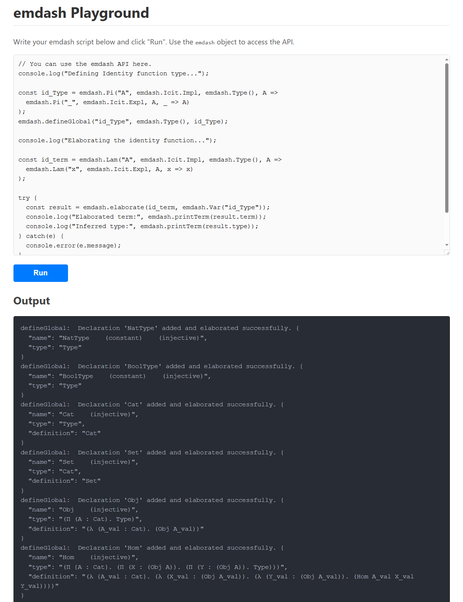

# emdash 2 — Functorial programming for strict/lax ω-categories in Lambdapi

## NEW UPDATED VERSION EMDASH 2 — [./emdash2/emdash2.lp](./emdash2/emdash2.lp) 

*GO TO: [./emdash2/emdash2.lp](./emdash2/emdash2.lp)*

We report on **emdash** https://github.com/hotdocx/emdash an ongoing experiment whose goal is a new *type-theoretical* account of strict/lax $\\omega$-categories that is both *internal* (expressed inside dependent type theory) and *computational* (amenable to normalization by rewriting). The current implementation target is the Lambdapi logical framework, and the guiding methodological stance is proof-theoretic: many categorical equalities are best presented as *normalization* (“cut-elimination”) steps rather than as external propositions.

The central construction is a dependent comma/arrow (“dependent hom”) operation that directly organizes “cells over a base arrow” in a simplicial manner. Concretely, let $B$ be a category and let $E$ be a dependent category over $B$ (informally a fibration $E: B\\to \\mathbf{Cat}$). Fix a base object $b_0\\in B$ and a fibre object $e_0\\in E(b_0)$. We construct a Cat-valued functor that assigns to a base arrow $b_{01}: b_0\\to b_1$ and a fibre object $e_1\\in E(b_1)$ the category of morphisms in the fibre over $b_1$ from the transport of $e_0$ along $b_{01}$ to $e_1$. In slogan form, this is a dependent arrow/comma object
$\\mathrm{Homd}_E(e_0,(-,-)) : E \\times_B \\bigl(\\mathrm{Hom}_B(b_0,-)\\bigr)^{\\mathrm{op}} \\to \\mathbf{Cat}.$
In the current kernel snapshot, this construction is computational in the Grothendieck/Grothendieck probe case (via a definitional rule for `homd_`), while full general normalization is still ongoing. The intended iteration yields a simplicial presentation of higher cells (triangles, surfaces, higher simplices), where “stacking” of $2$-cells along a $1$-cell is expressed *over a chosen base edge*.

As a complementary application, we outline a computational formulation of adjunctions in which unit and counit are first-class $2$-cell data and the triangle identities are oriented as definitional reductions on composites (e.g. $\\epsilon_f \\circ L(\\eta_g) \\rightsquigarrow f \\circ L(g)$ ). This showcases the broader emdash theme: coherence is enforced by computation, via stable rewrite heads for functoriality and “off-diagonal” components of transformations. The development is diagram-first: commutative diagrams are specified in a strict JSON format (Arrowgram) and rendered/checked as part of a reproducible paper artifact.

From an engineering perspective, this fits a “MathOps” workflow: a long-running feedback loop between an LLM assistant and a proof-checker/type-checker, where commutative diagrams are first-class artifacts. In emdash we use Arrowgram (a strict JSON diagram format) to make diagrams AI-editable, renderable (e.g. to SVG), and checkable alongside the kernel and the paper.

## Start here

- Lambdapi specification [`./emdash2/emdash2.lp`](./emdash2/emdash2.lp)
- Markdown report (copy of `./emdash2/print/public/index.md`): [`./docs/emdash2.md`](./docs/emdash2.md)
- PDF report (rendered from the markdown): [`./docs/emdash2.pdf`](./docs/emdash2.pdf)
- Original source: [https://github.com/1337777/cartier/blob/master/cartierSolution19.lp](https://github.com/1337777/cartier/blob/master/cartierSolution19.lp)
- Published report, editable: [https://hotdocx.github.io/r/26043CPAL64001](https://hotdocx.github.io/r/26043CPAL64001)
- arrowgram commutative diagrams/books/slides editor: [https://github.com/hotdocx/arrowgram/](https://github.com/hotdocx/arrowgram/)
- Attend Live Training on AI MathOps & AI workspaces: [https://hotdocx.github.io](https://hotdocx.github.io)
- Try and run the emdash AI workspace online: [https://LastRevision.pro/r/26044DLGJ77000](https://LastRevision.pro/r/26044DLGJ77000)

---

## Arrowgram

**Arrowgram** is a production-grade toolkit for creating commutative diagrams for the web and research papers. It is designed to be easily used by humans (via a sleek web editor) and AI coding agents (via a strictly typed JSON API).

**Try it now at: [https://hotdocx.github.io/arrowgram](https://hotdocx.github.io/arrowgram)**

## LastRevision on Hotdocx

LastRevision offers live cohort training that helps professionals use AI tools in general and apply them directly to Arrowgram workflows for diagrams, books, and slide decks.

No coding needed.

You learn practical ChatGPT and 15+ AI-tool workflows for real work, then use the same stack to produce publish-ready technical outputs in days, not months.

Weekly sessions focus on both:
- General AI productivity and delivery workflows you can reuse across roles
- Arrowgram-specific creation workflows for AI-assisted diagrams, papers/books, and slide decks

Join professionals, instructors, and researchers in live sessions that convert ideas into publishable outputs.

- 3 hours weekly Saturday cohorts, 7:30 PM GST (UTC+4)
- Free for this intro cohort
- 20,000+ community network
- Weekly live Saturday cohorts
- Hotdocx + LastRevision + Arrowgram stack

**Enroll and launch your workspace: [https://hotdocx.github.io](https://hotdocx.github.io)**

## LastRevision.pro

Build and publish your professional AI agents that co-work for you 24/7, save you time, and get you funded by fans and local clients.

- Dedicated 24/7 cloud computers
- Webhook trigger events, scheduled automations
- API tools, Gmail, Website, Latex, Excel, PDF tools
- Agent-to-agent marketplace
- Run your AI workspace from Telegram or WhatsApp chat
- OpenClaw-compatible 🦞 for professionals

**Explore LastRevision.pro: [https://LastRevision.pro/](https://LastRevision.pro/)**

---

## Overview
`emdash` is a TypeScript-based core for a dependently typed language, built with a strong emphasis on integrating concepts from category theory as first-class citizens. It provides a robust and extensible type theory kernel, featuring dependent types, a sophisticated elaboration engine, a powerful unification algorithm, and a reduction system that supports equational reasoning. The system aims to provide a flexible foundation for computational type theory and functorial programming, drawing inspiration from systems like Agda and Lambdapi.

### Quick links

[1] *emdash Experiment-able Testing Playground in hotdocx Web App*. [https://hotdocx.github.io/#/hdx/25188CHRI27000](https://hotdocx.github.io/#/hdx/25188CHRI27000) 

[2] *emdash Kernel Specification Written in the Lambdapi Proof Assistant*. [./spec/emdash_specification_lambdapi.lp](./spec/emdash_specification_lambdapi.lp)

[3] *emdash Technical Report*. [./docs/emdash.pdf](./docs/emdash.pdf) 

### Other links

[4] *emdash Re-formattable Technical Report in hotdocx Publisher*. [https://hotdocx.github.io/#/hdx/25188CHRI25004](https://hotdocx.github.io/#/hdx/25188CHRI25004) 

[5] *arrowgram App for Commutative Arrow Diagrams*. [https://github.com/hotdocx/arrowgram](https://github.com/hotdocx/arrowgram)

[6] *arrowgram AI Template in hotdocx Publisher*. [https://hotdocx.github.io/#/hdx/25188CHRI26000](https://hotdocx.github.io/#/hdx/25188CHRI26000) 

[7] *jsCoq AI Template for Coq in hotdocx Publisher*. [https://hotdocx.github.io/#/hdx/25191CHRI43000](https://hotdocx.github.io/#/hdx/25191CHRI43000)

[8] *hotdocX GitHub Sponsored Profile*. [https://github.com/sponsors/hotdocx](https://github.com/sponsors/hotdocx)

### Past/Future Work

[9] *emdash further Lambapi-specifications for ω-categories, sheaves and schemes*. [https://github.com/1337777/cartier/](https://github.com/1337777/cartier/)

TLDR: for the functoriality rule  `(F b) ∘> (F a)  ↪  F (b ∘> a)` it is clear that the size of the composition term `(b ∘> a)` in the RHS is smaller/decreasing; but for the naturality rule  `(ϵ._X) ∘> (G a)  ↪  (F a) _∘> (ϵ._Y)` it is not clear how to make the computation progress towards a smaller RHS, and the key insight by Kosta Dosen is that the RHS `_∘>` is actually a Yoneda/hom action/transport which is syntactically distinct than (but semantically equivalent to) the usual composition `∘>` ... Then extensionality/univalence is directly expressible via rules such as `@Hom Set $X $Y ↪ (τ $X → τ $Y)`. The prerequisite benchmark is whether `symbol super_yoneda_functor : Π [A : Cat], Π [B : Cat], Π (W: Obj A), Functor (Functor_cat B A) (Functor_cat B Set)` becomes computationally expressible by `reflexivity` proofs alone. Furthermore simplicial-cubical ω-categories become expressible via an elementary insight: given the usual triangle simplex `{0,1,2}` with arrows `f : 0 -> 1`, `g: 1 -> 2` and `h: 0 -> 2`, then the `projection functor` which maps a surface `σ: f -> h over g` to its base line `g` will indeed also functorially map a volume from `σ` down to a base surface from `g`... visually:  [https://cutt.cx/fTL](https://cutt.cx/fTL) — Ultimately it becomes expressible to extend the sheafification-functor given a site-topology closure-operator, and to specify a co-inductive computational logic interface for algebraic-geometry schemes, as outlined in [https://github.com/1337777/cartier/blob/master/cartierSolution16.lp](https://github.com/1337777/cartier/blob/master/cartierSolution16.lp)

## Core Features Implemented in Detail

### 1. Dependent Types and Type Theory Kernel

*   **Dependent Functions (Pi-types) and Lambda Abstractions**: The core language supports full dependent function types (`Pi`) and lambda abstractions (`Lam`), allowing for types to depend on values. These are defined in `src/types.ts` and processed by `src/elaboration.ts` and `src/parser.ts`.
*   **Type Universe (`Type`)**: `emdash` adheres to the "types-are-terms" principle, meaning types themselves are represented as terms within the system, with `Type` being the type of all types (up to a single universe level for simplicity).
*   **Elaboration Engine (`src/elaboration.ts`)**:
    *   **Bidirectional Type Checking**: The `check(term, expectedType)` and `infer(term)` functions are the pillars of the elaboration process, guiding type validation and inference. `check` verifies if a term conforms to a given type, while `infer` deduces a term's type.
    *   **Unification Constraints**: During the elaboration traversal, the system automatically generates unification constraints (e.g., `?h1 === NatType`) whenever two terms must be equal. These constraints are collected and solved later by `src/unification.ts`.
    *   **Implicit Arguments**: The elaborator automatically inserts implicit arguments (e.g., for `f : Π {A:Type}. A -> A`, `f 42` becomes `f {Nat} 42`) based on the `Icit.Impl` (implicit) flag in Pi-types. This significantly reduces verbosity. `src/implicit_args_tests.ts` provides comprehensive tests for this feature.
    *   **Kernel-defined Implicit Arguments (`src/constants.ts`)**: Special category theory constructors (like `FMap0Term`, `FMap1Term`, `NatTransComponentTerm`) have "kernel implicits" (e.g., source/target categories) that `ensureKernelImplicitsPresent` (in `src/elaboration.ts`) automatically fills with fresh holes if omitted, further streamlining term construction. This is thoroughly tested in `src/kernel_implicits_tests.ts`.
*   **Unification (`src/unification.ts`)**:
    *   **Constraint-based Algorithm**: The `solveConstraints()` function iteratively attempts to solve pending constraints using the `unify()` function.
    *   **Higher-Order Pattern Unification**: `unify()` is capable of solving higher-order problems (flex-rigid problems like `?M x y === f x`) using Miller's pattern unification (`solveHoFlexRigid`), finding appropriate lambda abstractions for meta-variables (holes). This is a crucial feature with dedicated tests in `tests/higher_order_unification_tests.ts`.
    *   **Meta-variables (Holes)**: Unassigned holes (`Hole` terms) act as meta-variables, representing unknown parts of a term or type that can be solved by unification. They are crucial for incremental elaboration and type inference.
    *   **Occurs Check**: Prevents infinite types during unification by ensuring a hole is not unified with a term containing itself. Tested in `tests/error_reporting_tests.ts`.
    *   **User-defined Unification Rules**: The `addUnificationRule` function (via `src/globals.ts`) allows users to provide hints to the solver for specific equality patterns, guiding the unification process beyond built-in decomposition rules.
*   **Reduction and Equality (`src/reduction.ts`, `src/equality.ts`)**:
    *   **Weak Head Normal Form (WHNF)**: The `whnf()` function performs β-reduction, unfolds global definitions (unless marked as opaque constants), and applies user-defined rewrite rules at the head of the term.
    *   **Full Normalization**: The `normalize()` function recursively applies `whnf()` to all subterms, yielding a fully reduced form.
    *   **β-reduction, η-contraction**: Supported for functions. Eta-contraction (`λx. F x ~> F`) can be enabled via a global flag (managed in `src/state.ts` and tested in `tests/equality_tests.ts`).
    *   **Term Convertibility (`areEqual`)**: The `areEqual()` function determines if two terms are convertible by reducing both to WHNF and then structurally comparing their forms, respecting α-equivalence for binders. Extensively tested in `tests/equality_tests.ts` and `tests/equality_inductive_type_family.ts`.
*   **Pattern Matching (`src/pattern.ts`)**:
    *   **Higher-Order Patterns**: The `matchPattern()` function is the core of rewrite rule application. It supports **higher-order patterns**, where pattern variables (e.g., `$F`) can stand for functions, enabling flexible matching. This is rigorously tested in `tests/higher_order_pattern_matching_tests.ts`.
    *   **Scope Annotations**: Pattern variables can carry scope annotations (`$F.[x]`), specifying which locally bound variables from the pattern's context they are allowed to capture, ensuring correct matching under binders (e.g., `λx. $F x` matches `λx. K x` to `$F = K`).
    *   **Capture-Avoiding Substitution**: The `applySubst` and `replaceFreeVar` functions ensure that substitutions are performed correctly without unintended variable capture, vital for `Lam`, `Pi`, and `Let` terms.

### 2. First-Class Category Theory Integration (Functorial Elaboration Emphasis)

The system natively supports fundamental category theory concepts, with their types and elaboration rules implemented to ensure mathematical soundness.

*   **Core Notions (`src/types.ts`)**:
    *   `CatTerm`: The type of categories.
    *   `ObjTerm C`: The type of objects in a category `C`.
    *   `HomTerm C X Y`: The type of morphisms from object `X` to object `Y` in category `C`.
*   **Functors (`src/types.ts`, `src/elaboration.ts`)**:
    *   `FunctorTypeTerm C D`: Represents the type of functors from category `C` to category `D`.
    *   `MkFunctorTerm`: This is a **kernel primitive for functor construction**. Unlike a simple lambda abstraction, `MkFunctorTerm` explicitly bundles a functor's data (`domainCat`, `codomainCat`, `fmap0`, `fmap1`) and optionally a `proof` of its functoriality laws (identity and composition preservation). Its elaboration, handled by `infer_mkFunctor` in `src/elaboration.ts`, rigorously checks the functoriality proof (if provided) or attempts to *compute* the equality by normalizing both sides of the functoriality law if no proof is explicitly given. This ensures that only mathematically sound functors can be constructed. Tested in `tests/functorial_elaboration.ts`.
    *   `FMap0Term` (`fmap0 F X`): Represents the application of a functor `F` to an object `X`. It returns an object in the codomain category.
    *   `FMap1Term` (`fmap1 F a`): Represents the application of a functor `F` to a morphism `a`. It returns a morphism in the codomain category.
*   **Natural Transformations (`src/types.ts`, `src/elaboration.ts`)**:
    *   `NatTransTypeTerm F G`: Represents the type of a natural transformation between two functors `F` and `G` (which must have the same domain and codomain categories).
    *   `NatTransComponentTerm` (`tapp alpha X`): Represents the component of a natural transformation `alpha` at object `X`, which is a morphism in the codomain category.
*   **Built-in Categories and Functors**:
    *   `SetTerm`: The initial standard library (`src/stdlib.ts`) defines `Set` as a built-in category, representing the category of sets and functions. Its `Hom` type (i.e., `Hom Set X Y`) is reduced to a `Pi` type (`Π (_:X). Y`), aligning with the set-theoretic interpretation of functions.
    *   `HomCovFunctorIdentity`: Represents the covariant Hom-functor `Hom_A(W, -)`. Its application (`fmap0 (HomCovFunctor A W) Y`) reduces to `Hom A W Y`, showcasing how functorial concepts are integrated into the core reduction rules.
*   **Standard Library (`src/stdlib.ts`)**: This module is crucial for setting up the initial categorical environment. it defines core category theory primitives like `identity_morph` (identity morphism) and `compose_morph` (composition of morphisms), tested in `tests/phase1_tests.ts`. More importantly for functorial elaboration, it also sets up key rewrite rules, including the **naturality law** for natural transformations and the **functoriality of composition** for functors. These rules are integral to proving properties in the system and are automatically applied during reduction.

### 3. Extensibility and System Management

*   **Global Context (`src/state.ts`, `src/globals.ts`)**: `defineGlobal` provides the mechanism to introduce new constants, functions, and types into the global environment, making them available throughout the system. The `globalDefs` map in `src/state.ts` manages these definitions.
*   **User-defined Rewrite Rules (`src/globals.ts`)**: The `addRewriteRule` function allows users to extend the system's equational reasoning capabilities by defining custom rewrite rules. A crucial constraint is that the Left Hand Side (LHS) of a rewrite rule cannot have a kernel constant symbol as its head, ensuring that core system behavior remains predictable. Tested in `tests/rewrite_rules_tests.ts` and `tests/rewrite_rules_tests2.ts`.
*   **User-defined Unification Rules (`src/globals.ts`)**: `addUnificationRule` enables users to provide specific hints to the unification solver, which can be invaluable for complex unification problems (e.g., encoding associativity of composition as a unification hint).
*   **System Initialization (`src/stdlib.ts`)**: The `resetMyLambdaPi_Emdash` function provides a clean slate, fully resetting the global state (including `globalDefs`, `userRewriteRules`, `userUnificationRules`, `constraints`, and internal IDs) and re-initializing the standard library, including all built-in category theory definitions and rules.
*   **Proof Mode Support (`src/proof.ts` - preliminary)**: This module lays the groundwork for an interactive proof assistant. It includes utilities such as `findHoles` (to locate unsolved subgoals), `getHoleGoal` (to inspect a specific subgoal's context and type), and core tactics like `refine`, `intro` (for introducing lambda/Pi binders), `exact` (for direct solutions), and `apply` (for applying functions to goals). This indicates a path towards a more interactive and user-guided theorem proving experience. Tested in `tests/proof_mode_tests.ts`.
*   **Parser (`src/parser.ts`)**: A new parser (`parse` function) is implemented using `parsimmon` to parse string representations of terms into the internal `Term` AST. It supports a more elaborate syntax for `let`, `fun`/`\`, `->`, and grouped binders. Tested in `tests/parser_tests.ts`.

## Project Structure (src/)

*   `src/types.ts`: Defines all core data structures, including `Term` (the abstract syntax tree for all expressions), `Context`, `Icit` (implicitness), `Binding`, and various term constructors (e.g., `App`, `Lam`, `Pi`, `Hole`). It also defines interfaces for global definitions, rewrite rules, and unification rules, and all the category theory specific term types.
*   `src/state.ts`: Manages the global mutable state of the `emdash` system, including `globalDefs`, `userRewriteRules`, `userUnificationRules`, `constraints`, and global flags (e.g., `etaEquality`). It also provides utilities for fresh name generation (`freshVarName`, `freshHoleName`), context manipulation (`extendCtx`, `lookupCtx`), term reference resolution (`getTermRef`), pretty-printing (`printTerm`), and identifying kernel constant symbols or injective constructors.
*   `src/constants.ts`: Defines shared constants like `MAX_STACK_DEPTH` (for recursion limits) and specifies metadata for "kernel-defined" implicit arguments (e.g., categories for functors) that the elaborator uses to ensure their presence.
*   `src/elaboration.ts`: The central module implementing the core type checking (`check`) and inference (`infer`) algorithms. It orchestrates the entire elaboration process, including implicit argument insertion, kernel implicit handling, and the initial setup of unification constraints. It also contains specific logic for `infer_mkFunctor` which embodies the "functorial elaboration" process. Errors during elaboration are typically caught and re-thrown with context-rich messages.
*   `src/unification.ts`: Implements the constraint solving mechanism (`solveConstraints`) and the core unification algorithm (`unify`). It handles higher-order unification (`solveHoFlexRigid`), performs occurs checks to prevent infinite types, and applies user-defined unification rules.
*   `src/reduction.ts`: Contains the term evaluation logic, including `whnf` (Weak Head Normal Form) and `normalize` (full normalization), β-reduction, η-contraction (if enabled), unfolding of global definitions, and application of rewrite rules. This module is critical for establishing convertibility.
*   `src/equality.ts`: Implements the `areEqual` function for checking term convertibility (equality) by reducing terms to WHNF and performing structural comparison. It also contains a helper for comparing lists of arguments, crucial for matching complex term structures.
*   `src/parser.ts`: Implements the parsing logic for the `emdash` language, converting string source code into the internal `Term` abstract syntax tree. It defines rules for various syntactic constructs like lambdas, Pi-types, applications, and let expressions, handling explicit and implicit binders.
*   `src/pattern.ts`: Provides functions for higher-order pattern matching (`matchPattern`), applying substitutions (`applySubst`), collecting free variables (`getFreeVariables`), and transforming terms by abstracting over variables (`abstractTermOverSpine`). This module is foundational for rewrite rules and higher-order unification.
*   `src/globals.ts`: Offers the user-facing API for extending the system's global environment, including `defineGlobal`, `addRewriteRule`, and `addUnificationRule`. It includes type checking and validation for these user-defined components.
*   `src/stdlib.ts`: Defines the standard library, providing the initial set of types, terms, and rules for fundamental category theory concepts and basic logical constructs. It's where the system's "axioms" and initial definitions are set up, including identity and composition morphisms, and naturality laws. It also contains the `resetMyLambdaPi_Emdash` function for re-initializing the system.
*   `src/structural.ts`: Provides utility functions for checking raw structural equality between terms *without* performing any reduction or unification. This is used for quick, shallow comparisons when convertibility is not required.
*   `src/proof.ts`: (Preliminary) Contains the infrastructure for an interactive proof mode, allowing users to inspect the proof state (holes), report on goals, and refine them using various tactics (`intro`, `exact`, `apply`). This module directly interacts with the `elaboration.ts` and `state.ts` to manage subgoals.
*   `src/util.ts`: (Note: This file was listed but not found during the file reading phase. If it exists, it likely contains general utility functions not directly tied to the core type theory, such as debugging helpers or minor transformations.)

## Testing (tests/)

The `tests/` directory contains a comprehensive suite of unit tests, designed to ensure the correctness, stability, and adherence to type-theoretic principles of the `emdash` core logic. Each test file focuses on specific aspects:

*   `tests/parser_tests.ts`: Validates the new parsing logic (`src/parser.ts`) for various language constructs, ensuring correct conversion of string syntax into `Term` ASTs, including complex binder groups and precedence.
*   `tests/main_tests.ts`: Contains high-level integration tests or a collection of miscellaneous tests that cover multiple components working together.
*   `tests/rewrite_rules_tests.ts` and `tests/rewrite_rules_tests2.ts`: Verify the correct elaboration and application of user-defined rewrite rules, including recursive rules and handling of pattern variables. They also test error conditions for ill-typed rules.
*   `tests/let_binding_tests.ts`: Specifically tests the `Let` term constructor, ensuring correct scoping, type checking, and reduction behavior for let-bindings.
*   `tests/church_encoding_tests.ts` and `tests/church_encoding_implicit_tests.ts`: Validate the system's ability to handle Church encodings for natural numbers and booleans, demonstrating the flexibility of the type system in representing data. `church_encoding_implicit_tests.ts` likely focuses on how implicit arguments interact with these encodings.
*   `tests/equality_inductive_type_family.ts`: Focuses on testing equality and reduction for inductive types defined with type families, which often involve more complex dependent type interactions.
*   `tests/dependent_types_tests.ts`: Tests the core dependent type features using complex examples like length-indexed vectors (`Vec`), including their definitions, constructors, and operations.
*   `tests/elaboration_options_tests.ts`: Verifies the behavior of various options passed to the `elaborate` function, such as `normalizeResultTerm`, ensuring fine-grained control over the elaboration process.
*   `tests/equality_tests.ts`: Comprehensive tests for `areEqual`, covering α-equivalence (renaming of bound variables), β-reduction (function application), and η-conversion (function extensionality), and other term convertibility properties.
*   `tests/error_reporting_tests.ts`: Ensures that the system throws sensible and informative errors for common type-theoretic mistakes, such as unbound variables, type mismatches, and occurs check failures.
*   `tests/functorial_elaboration.ts`: Specifically tests the `MkFunctorTerm` and its associated `infer_mkFunctor` logic, verifying that the functoriality laws (identity and composition preservation) are correctly checked, whether by explicit proof or computational verification. It also includes tests for cases where functoriality laws are violated.
*   `tests/higher_order_pattern_matching_tests.ts`: Contains specific tests for the higher-order pattern matcher (`src/pattern.ts`), verifying its ability to match patterns where variables represent functions and handle scope restrictions.
*   `tests/higher_order_unification_tests.ts`: Tests the higher-order unification solver (`solveHoFlexRigid` in `src/unification.ts`) with various flex-rigid problems and scenarios, including cases of non-linear patterns and occurs checks.
*   `tests/implicit_args_tests.ts`: Validates the automatic insertion and checking of implicit arguments during elaboration, including how they are inferred and filled.
*   `tests/inductive_types.ts`: Explores the definition of inductive types (like Natural Numbers and Lists) and their associated eliminators or recursive functions, often leveraging rewrite rules for computation.
*   `tests/kernel_implicits_tests.ts`: Specifically tests the handling of "kernel implicits" for category theory constructors (like `FMap0Term`), ensuring they are correctly inserted and typed during elaboration.
*   `tests/phase1_tests.ts`: Focuses on initial categorical primitives and their projections, ensuring the foundational category theory concepts are correctly implemented and integrated.
*   `tests/proof_mode_tests.ts`: Tests the preliminary proof mode functionalities (`src/proof.ts`), such as finding holes, reporting goal states, and applying basic tactics like `intro`, `exact`, and `apply`.
*   `tests/utils.ts`: Contains general utility functions used across the test suite, such as custom assertion helpers (`assertEqual`, `assert`) for clearer test failures. 