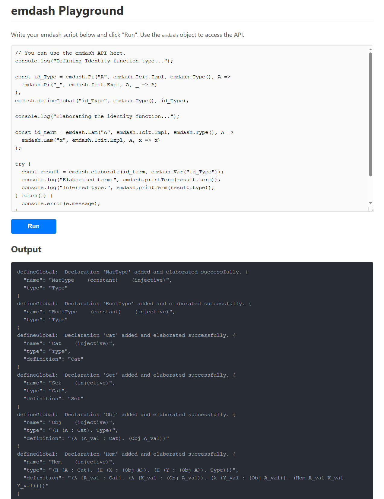

# emdash — Functorial programming for ω-categories in Lambdapi (v3.2 arrow induction)

## NEW UPDATED VERSION EMDASH 3.2 — [./emdash2/emdash3_2.lp](./emdash2/emdash3_2.lp)

The current v3.2 draft of **emdash** is a Lambdapi formalization and prototype
proof assistant aimed at functorial programming with strict/lax higher
ω-categorical structure. Its computational core internalizes categorical
action in the style of Kosta Došen's cut-elimination techniques. The main
exposition is now the expanded development edition of *Functorial Type Theory:
Univalent Foundations for Mathematics*, which combines checked Lambdapi
evidence with clearly marked formal consequences, mathematical development,
and research boundaries.

Primary artifacts:

- Book PDF: [`./docs/emdash-book.pdf`](./docs/emdash-book.pdf)
- Book Markdown snapshot: [`./docs/emdash3_2.md`](./docs/emdash3_2.md)
- Compatibility PDF filename: [`./docs/emdash3_2.pdf`](./docs/emdash3_2.pdf)
- Active Lambdapi kernel: [`./emdash2/emdash3_2.lp`](./emdash2/emdash3_2.lp)
- Book sources and evidence map: [`./emdash2/book/`](./emdash2/book/)
- TypeScript v3.2 elaborator handoff:
  [`./docs/TYPESCRIPT_ELABORATOR_V3_2_HANDOFF.md`](./docs/TYPESCRIPT_ELABORATOR_V3_2_HANDOFF.md)
- Completed TypeScript `emdash-v3.2-mvp-1` master plan and historical `/goal`
  prompt:
  [`./docs/TYPESCRIPT_ELABORATOR_V3_2_MASTER_PLAN.md`](./docs/TYPESCRIPT_ELABORATOR_V3_2_MASTER_PLAN.md)
- Reviewed TypeScript DTT/LF continuation plan:
  [`./docs/TYPESCRIPT_ELABORATOR_V3_2_DTT_LF_CONTINUATION_PLAN.md`](./docs/TYPESCRIPT_ELABORATOR_V3_2_DTT_LF_CONTINUATION_PLAN.md)
- Active systematic-transfer scale-qualification plan and `/goal` prompt:
  [`./docs/TYPESCRIPT_ELABORATOR_V3_2_SCALE_QUALIFICATION_PLAN.md`](./docs/TYPESCRIPT_ELABORATOR_V3_2_SCALE_QUALIFICATION_PLAN.md)
- Active external-review demo and measured product-boundary plan:
  [`./docs/TYPESCRIPT_ELABORATOR_V3_2_PRODUCT_DEMO_PLAN.md`](./docs/TYPESCRIPT_ELABORATOR_V3_2_PRODUCT_DEMO_PLAN.md)
- Measured browser-demonstration subplan:
  [`./docs/TYPESCRIPT_ELABORATOR_V3_2_BROWSER_DEMO_PLAN.md`](./docs/TYPESCRIPT_ELABORATOR_V3_2_BROWSER_DEMO_PLAN.md)
- User-syntax and recursive-resolution subplan:
  [`./docs/TYPESCRIPT_ELABORATOR_V3_2_USER_SYNTAX_PLAN.md`](./docs/TYPESCRIPT_ELABORATOR_V3_2_USER_SYNTAX_PLAN.md)
- Implemented ELAB-0 RFC and TypeScript-kernel reassessment:
  [`./docs/TYPESCRIPT_ELABORATOR_V3_2_ELAB_0_RFC.md`](./docs/TYPESCRIPT_ELABORATOR_V3_2_ELAB_0_RFC.md)
- Persistent-goal Git experimentation and checkpoint workflow:
  [`./docs/PERSISTENT_GOAL_GIT_EXPERIMENTATION.md`](./docs/PERSISTENT_GOAL_GIT_EXPERIMENTATION.md)

## TypeScript v3.2 deployed profile

`emdash-v3.2-mvp-1` is the release-ready exact profile. After H-05/D-039, the
small TypeScript checker/evaluator is the authoritative deployed runtime only
for its 16 owners and three reviewed runtime rules. The browser entry point is
[`src/v3_2/browser.ts`](./src/v3_2/browser.ts), which exposes the frozen
`CORE_MVP_MANIFEST` identity and has no production Lambdapi dependency.
String parsing is not part of this release; applications construct the typed
surface or explicit Core AST directly.

Lambdapi remains the active mathematical specification, the required
fixed-corpus CI and subject-reduction oracle, and the acceptance authority for
five selected semantic-boundary changes:

1. a selected owner signature;
2. a selected runtime-rule shape or authority;
3. promotion of an owner or rule into the product profile;
4. a termination, confluence, or subject-reduction claim;
5. a shared-corpus backend binding.

Refactors, diagnostic/surface work, and packaging changes that preserve the
frozen semantic and browser-import boundaries do not require a new
declaration-level authority review. General confluence and standalone
TypeScript subject reduction remain withheld, and no latency, throughput, or
scale SLA is claimed.

The TypeScript-only development baseline still skips process-backed probes:

```bash
./scripts/pnpmw run check:ts
```

The explicit conformance gate requires Lambdapi and runs all three frozen
differential suites with no opt-in skips under a 60-second bound:

```bash
./scripts/pnpmw run check:conformance
```

`check:all` now includes that conformance gate before the complete Lambdapi
workspace CI. The deep-frozen `CORE_MVP_RELEASE_COMPLETION` records that all
21 capability rows and the three release slices are complete, with no release
blocker. H-02 and H-06 remain conditional, untriggered future gates rather
than hidden release requirements.

## TypeScript DTT/LF opt-in continuation profile

H-DTTLF-03/D-DTTLF-001 separately authorizes
`emdash-v3.2-dttlf-directed-1` through the root-only
[`src/v3_2/index.ts`](./src/v3_2/index.ts) entry point. Call
`createCoreDirectedContinuationKernel()` to obtain its reviewed persistent
catalog and checker/evaluator. The exact closure contains 20 base signatures,
nine reviewed continuation declarations, seven directed runtime rules, and
the three inherited MVP runtime rules. It has zero proof-time rules and one
shared 256-step outer-LF budget.

This is an authoritative **opt-in** continuation profile, not a browser or
deployed-MVP replacement. The browser still exposes only
`emdash-v3.2-mvp-1`; neither profile requires Lambdapi at production runtime.
Lambdapi remains the active mathematical specification and the required fixed
positive, negative, and subject-reduction oracle for selected continuation
changes.

Run its separate mandatory conformance corpus with:

```bash
./scripts/pnpmw run check:directed-conformance
```

The complete continuation gate preserves the frozen MVP `check:all` policy
and then runs that corpus:

```bash
./scripts/pnpmw run check:continuation
```

Combined termination, unrestricted normalization, confluence, standalone
TypeScript subject reduction, performance, release readiness,
internal-Pi/uncurrying, and systematic groupoidal closure remain unclaimed.

## TypeScript systematic-transfer qualification

The explicit Core, outer LF, scoped builder, reviewed catalog/profile
boundary, and Lambdapi conformance role are retained. The current
29-signature/ten-rule continuation does not yet prove a mechanical path for
the rest of the active Lambdapi development, especially module visibility,
inductives, grouped rules, transparent proof closures, and proof-time
unification.

SCALE-0A therefore inventories the checked deterministic canonical export of
all five active modules with a pure fail-closed TypeScript parser. Run its
bounded live exporter/hash/count gate with:

```bash
./scripts/pnpmw run check:scale-inventory
```

The aggregate forward gate preserves the full reviewed continuation and then
runs that live inventory:

```bash
./scripts/pnpmw run check:scale
```

Canonical export is a development/build interchange candidate only. The
handwritten Lambdapi sources remain mathematical authority, semantic import
still requires review, and production has no Lambdapi runtime dependency.

## TypeScript external-review demo

The current root-only TypeScript continuation can be reviewed as one
three-panel demonstration:

```bash
./scripts/pnpmw run demo:external-review
```

It runs the existing outer dependent-LF Sigma-telescope, ordinary functorial
bracket, and genuine displayed dependency-chain witnesses; prints explicit
Core, inferred/reduced types, structural lowering, object/arrow computation,
and negative diagnostics; and has no production Lambdapi or string-parser
dependency. The command adds no mathematical owner, runtime rule, or checker
branch and does not change the frozen browser profile.

The self-contained walkthrough and exact limitation boundary are in
[`./docs/TYPESCRIPT_ELABORATOR_V3_2_EXTERNAL_REVIEW_DEMO.md`](./docs/TYPESCRIPT_ELABORATOR_V3_2_EXTERNAL_REVIEW_DEMO.md).
The optional higher-action witness remains available as:

```bash
./scripts/pnpmw run demo:categorical-displayed-nd-higher
```

## TypeScript browser demo

The standalone browser fixture now exposes two client-side views:

- a fixed outer dependent-LF Sigma-telescope witness with explicit Core,
  inferred/reduced types, a two-step computation trace, and a wrong-family
  diagnostic; and
- the preserved editable `emdash-v3.2-mvp-1` minimal-Core playground.

Build both from the repository root with:

```bash
./scripts/pnpmw run check:browser-directed
```

The output under `emdash-template/dist/` uses relative assets and is suitable
for a static project-subpath deployment such as
`https://hotdocx.github.io/emdash/`. It runs the TypeScript checker/evaluator
entirely in the client with no Node builtin or production Lambdapi process.
No GitHub Pages workflow or publication is included yet, and categorical
browser promotion remains a separately measured boundary.

## Development workspace and Git worktrees

The repository uses one pnpm 11 workspace and one `pnpm-lock.yaml` for the
root TypeScript workbench, `emdash2`, and `emdash2/print`. The
`emdash-template` directory remains a standalone distributable npm fixture.
Node 22.13 or newer is required; Lambdapi is additionally required for the
formal kernel checks.

Bootstrap a fresh checkout or Git worktree from the repository root:

```bash
./scripts/bootstrap-worktree.sh
```

No global pnpm install is required when Corepack is available. The wrapper
uses the `packageManager` version pinned in `package.json`, and package content
is reused through pnpm's shared content-addressable store. Check its location
with:

```bash
./scripts/pnpmw store path
```

Browser binaries are also cached outside individual worktrees. On a new
machine, install the renderer's pinned Chromium once before browser-based
print checks:

```bash
./scripts/pnpmw run print:browser:install
```

For parallel work, give each branch its own worktree and dependency-link graph:

```bash
git worktree add ../emdash1-elaborator -b work/elaborator-v3.2
cd ../emdash1-elaborator
./scripts/bootstrap-worktree.sh
```

Do not share or symlink a mutable `node_modules` directory between worktrees;
pnpm already shares the immutable package content while keeping branch-specific
dependency graphs isolated. Do not run `npm install` in the contributor
workspace or recreate the retired root/print npm lockfiles.

For a long-running Codex `/goal`, use the living task plan and
[`./docs/PERSISTENT_GOAL_GIT_EXPERIMENTATION.md`](./docs/PERSISTENT_GOAL_GIT_EXPERIMENTATION.md).
Persistence alone does not authorize Git mutations. A task prompt may
explicitly authorize local validated checkpoint commits on a dedicated goal
branch, but that does not authorize push, merge, history rewriting,
publication, branch deletion, or worktree removal.

Common root commands are:

```bash
./scripts/pnpmw run check:ts
./scripts/pnpmw run check:conformance
./scripts/pnpmw run kernel:check
./scripts/pnpmw run print:check
./scripts/pnpmw run book:check
./scripts/pnpmw run check:all
```

When starting Codex from either the root or `emdash2`, the canonical root
`AGENTS.md` routes the task and the closer `emdash2/AGENTS.md` supplies the
formal-kernel SOP.

Infinity Codex is also repository-wide. The sole project hook configuration
is [`.codex/hooks.json`](./.codex/hooks.json), and both root and nested
launches call the same
[`scripts/infinity_codex.py`](./scripts/infinity_codex.py) implementation.
The existing private archive remains under ignored
`emdash2/tmp/ai-responses/`. After installing or changing the hook, restart
Codex and use `/hooks` to inspect and trust its current hash.

The book leads with the walking-endomorphism directed higher-inductive
category `WalkingEnd`: an opaque base object and one directed generating
endomorphism, equipped with a contextual eliminator rather than a
definitionally Nat-valued hom. Its encode-decode calculation constructs a
directed normalization cell before one-dimensionality extracts equality and
establishes the carrier correspondence

```text
Hom_W(*,*) ≃ Nat.
```

The separate one-object category `BNat` is retained as a concrete consistency
model, not as the definition of `WalkingEnd`. From this opening computation,
the book develops a second spiral through represented hom action, strict/lax
transfors and controlled naturality cuts, ordinary and native category theory,
adjunctions, Yoneda and profunctors, duality, structure identity and
saturation, weighted limits and colimits, and directed join. Appendix G gives
the formal architecture: the explicit categorical calculus is the
computational kernel; readable mathematical notation is its surface; a future
end-user elaborator may compile into that kernel; and external semantic models
remain a separate layer.

The current v3.2 implementation is organized around these active modules:

- kernel and generic `fapp*`/`tapp*` computation:
  [`emdash3_2.lp`](./emdash2/emdash3_2.lp);
- equality-valued hom action and groupoidality:
  [`emdash3_2_eq1_hom_action.lp`](./emdash2/emdash3_2_eq1_hom_action.lp);
- evidence-property and finite-dimension truncation:
  [`emdash3_2_eq1_evidence_property.lp`](./emdash2/emdash3_2_eq1_evidence_property.lp);
- reusable Nat arithmetic and sethood:
  [`emdash3_2_nat_arithmetic.lp`](./emdash2/emdash3_2_nat_arithmetic.lp);
- WalkingEnd, `BNat`, code, decoder, and carrier comparison:
  [`emdash3_2_walking_end_hit.lp`](./emdash2/emdash3_2_walking_end_hit.lp);
- executable regression evidence:
  [`emdash3_2_checks.lp`](./emdash2/emdash3_2_checks.lp).

The basic construction underneath the draft is the directed dependent hom. For
a category-valued family

```text
E : K ⊢ Cat
```

where `⊢` denotes a functor category, and fixed data `x : K`, `u : E[x]`,
emdash forms a functorial object

```text
homd_E(x,u)
  : Π(y : K^op), E[y^-] ⊢_[y] (Hom_K(x,y)^op ⊢ Cat)
```

Here `⊢_[y]` is the mixed-variance displayed version of `⊢`, and `y^-` marks
that the `E`-argument occurs contravariantly. Its value at `y`, `v : E[y]`,
and `f : x → y` is

```text
Hom_{E[y]}(E[f](u),v).
```

This is also what organizes arrows in Sigma totals:

```text
Hom_{ΣE}((x,u),(y,v))
  = Σ(f : x → y), Hom_{E[y]}(E[f](u),v).
```

The same normalization-first architecture drives this simplicial ω-iteration
and also covers product/curry structure, computational adjunctions, structural
operations such as weakening/symmetry/contraction, and vertical/horizontal
composition, whiskering, interchange, and stacking of higher cells; sheaves and
schemes are feasible too.

The motivating example is the familiar shape of path induction in dependent
type theory. For a category `Z` and an object `x : Z`, replace paths out of
`x` by the outgoing-arrow category, i.e. the coslice/undercategory

```text
x ↓ Z = Σ(y : Z), Hom_Z(x,y).
```

The object `(x,id_x)` is initial in `(x ↓ Z)`. For `a = (y,p)`, the canonical
arrow `(x,id_x) → a` is `p` itself. Thus, for a motive

```text
E : (x ↓ Z) ⊢ Cat
```

and `u : E((x,id_x))`, fixed-source directed induction has the expected
section

```text
Ind_x(E,u) : Π(a : (x ↓ Z)), E(a)

Ind_x(E,u)(y,p) = E(p)(u).
```

Write `Rep_Z(t)` for the covariant representable `Hom_Z(t,-)`. For the
composition motive

```text
E[(y,p)] ≔ Rep_Z(y) ⊢ Rep_Z(x)
```

with initial datum `id : Rep_Z(x) ⊢ Rep_Z(x)`, this computes to ordinary
composition: for `p : x → y` and `q : y → z`,

```text
Ind_x(E,id)[(y,p)][z][q] ↝ q ∘ p.
```

The new phenomenon appears when the source object `x` itself is internalized.
For an arrow `r : x → y`, precomposition gives

```text
r^* : (y ↓ Z) ⊢ (x ↓ Z)

r^*(z,q : y → z) = (z,q ∘ r).
```

Once induction is internalized as a construction varying in `x`, the target
`Π`/section-taking construction

```text
x ↦ (E ↦ Π(a : (x ↓ Z)), E(a))
```

is itself a displayed construction over the moving source object `x`. Its
transport/comparison along `r` is not the identity; it is the section-pullback
functor

```text
Π(a : (x ↓ Z)), E(a)
  ⊢
Π(b : (y ↓ Z)), E(r^*(b))
```

sending `s` to `b ↦ s(r^*(b))`.

This is the lax naturality/functoriality layer exposed by the internalized
formulation of directed path induction in `emdash` v3.2. An open question is
whether this phenomenon has an established name or prior formulation in
categorical logic, HoTT, or higher category theory.

## Start here

- Book PDF: [`./docs/emdash-book.pdf`](./docs/emdash-book.pdf)
- Book Markdown snapshot: [`./docs/emdash3_2.md`](./docs/emdash3_2.md)
- Compatibility PDF copy: [`./docs/emdash3_2.pdf`](./docs/emdash3_2.pdf)
- Lambdapi specification [`./emdash2/emdash3_2.lp`](./emdash2/emdash3_2.lp)
- Active book source tree: [`./emdash2/book/`](./emdash2/book/)
- Original source: [https://github.com/1337777/cartier/blob/master/cartierSolution19.lp](https://github.com/1337777/cartier/blob/master/cartierSolution19.lp)
- Published report, editable: [https://hotdocx.github.io/r/26043CPAL64001](https://hotdocx.github.io/r/26043CPAL64001)
- arrowgram commutative diagrams/books/slides editor: [https://github.com/hotdocx/arrowgram/](https://github.com/hotdocx/arrowgram/)
- Attend Live Training on AI MathOps & AI workspaces: [https://hotdocx.github.io](https://hotdocx.github.io)
- Try and run the emdash AI workspace online: [https://LastRevision.pro/r/26044DLGJ77000](https://LastRevision.pro/r/26044DLGJ77000)

---

## Arrowgram

**Arrowgram** is a production-grade toolkit for creating commutative diagrams for the web and research papers. It is designed to be easily used by humans (via a sleek web editor) and AI coding agents (via a strictly typed JSON API).

**Try it now at: [https://hotdocx.github.io/arrowgram](https://hotdocx.github.io/arrowgram)**

## LastRevision on Hotdocx

LastRevision offers live cohort training that helps professionals use AI tools in general and apply them directly to Arrowgram workflows for diagrams, books, and slide decks.

No coding needed.

You learn practical ChatGPT and 15+ AI-tool workflows for real work, then use the same stack to produce publish-ready technical outputs in days, not months.

Weekly sessions focus on both:
- General AI productivity and delivery workflows you can reuse across roles
- Arrowgram-specific creation workflows for AI-assisted diagrams, papers/books, and slide decks

Join professionals, instructors, and researchers in live sessions that convert ideas into publishable outputs.

- 3 hours weekly Saturday cohorts, 7:30 PM GST (UTC+4)
- Free for this intro cohort
- 20,000+ community network
- Weekly live Saturday cohorts
- Hotdocx + LastRevision + Arrowgram stack

**Enroll and launch your workspace: [https://hotdocx.github.io](https://hotdocx.github.io)**

## LastRevision.pro

Build and publish your professional AI agents that co-work for you 24/7, save you time, and get you funded by fans and local clients.

- Dedicated 24/7 cloud computers
- Webhook trigger events, scheduled automations
- API tools, Gmail, Website, LaTeX, Excel, PDF tools
- Agent-to-agent marketplace
- Run your AI workspace from Telegram or WhatsApp chat
- OpenClaw-compatible 🦞 for professionals

**Explore LastRevision.pro: [https://LastRevision.pro/](https://LastRevision.pro/)**

---

## Historical TypeScript Prototype Overview

The remainder of this section describes the earlier executable TypeScript
prototype. Its generic elaboration, unification, reduction, and proof-state
machinery is implementation evidence, but its built-in category layer predates
and does not define the active v3.2 Lambdapi kernel. Renewed implementation
work starts from the v3.2 elaborator handoff linked above. The legacy files
named below were physically removed after their independently useful
mechanisms were replaced and audited in MIGRATE-1/MIGRATE-2; this section is
retained only as historical design evidence.

`emdash` is a TypeScript-based core for a dependently typed language, built with a strong emphasis on integrating concepts from category theory as first-class citizens. It provides a robust and extensible type theory kernel, featuring dependent types, a sophisticated elaboration engine, a powerful unification algorithm, and a reduction system that supports equational reasoning. The system aims to provide a flexible foundation for computational type theory and functorial programming, drawing inspiration from systems like Agda and Lambdapi.

### Quick links

[1] *emdash Experiment-able Testing Playground in hotdocx Web App*. [https://hotdocx.github.io/#/hdx/25188CHRI27000](https://hotdocx.github.io/#/hdx/25188CHRI27000)

[2] *emdash Kernel Specification Written in the Lambdapi Proof Assistant*. [./spec/emdash_specification_lambdapi.lp](./spec/emdash_specification_lambdapi.lp)

[3] *emdash Technical Report*. [./docs/emdash.pdf](./docs/emdash.pdf)

### Other links

[4] *emdash Re-formattable Technical Report in hotdocx Publisher*. [https://hotdocx.github.io/#/hdx/25188CHRI25004](https://hotdocx.github.io/#/hdx/25188CHRI25004)

[5] *arrowgram App for Commutative Arrow Diagrams*. [https://github.com/hotdocx/arrowgram](https://github.com/hotdocx/arrowgram)

[6] *arrowgram AI Template in hotdocx Publisher*. [https://hotdocx.github.io/#/hdx/25188CHRI26000](https://hotdocx.github.io/#/hdx/25188CHRI26000)

[7] *jsCoq AI Template for Coq in hotdocx Publisher*. [https://hotdocx.github.io/#/hdx/25191CHRI43000](https://hotdocx.github.io/#/hdx/25191CHRI43000)

[8] *hotdocx GitHub Sponsored Profile*. [https://github.com/sponsors/hotdocx](https://github.com/sponsors/hotdocx)



### Past/Future Work

[9] *emdash further Lambdapi specifications for ω-categories, sheaves and schemes*. [https://github.com/1337777/cartier/](https://github.com/1337777/cartier/)

TLDR: for the functoriality rule  `(F b) ∘> (F a)  ↪  F (b ∘> a)` it is clear that the size of the composition term `(b ∘> a)` in the RHS is smaller/decreasing; but for the naturality rule  `(ϵ._X) ∘> (G a)  ↪  (F a) _∘> (ϵ._Y)` it is not clear how to make the computation progress towards a smaller RHS, and the key insight by Kosta Došen is that the RHS `_∘>` is actually a Yoneda/hom action/transport which is syntactically distinct than (but semantically equivalent to) the usual composition `∘>` ... Then extensionality/univalence is directly expressible via rules such as `@Hom Set $X $Y ↪ (τ $X → τ $Y)`. The prerequisite benchmark is whether `symbol super_yoneda_functor : Π [A : Cat], Π [B : Cat], Π (W: Obj A), Functor (Functor_cat B A) (Functor_cat B Set)` becomes computationally expressible by `reflexivity` proofs alone. Furthermore simplicial-cubical ω-categories become expressible via an elementary insight: given the usual triangle simplex `{0,1,2}` with arrows `f : 0 -> 1`, `g: 1 -> 2` and `h: 0 -> 2`, then the `projection functor` which maps a surface `σ: f -> h over g` to its base line `g` will indeed also functorially map a volume from `σ` down to a base surface from `g`... visually:  [https://cutt.cx/fTL](https://cutt.cx/fTL) — Ultimately it becomes expressible to extend the sheafification-functor given a site-topology closure-operator, and to specify a co-inductive computational logic interface for algebraic-geometry schemes, as outlined in [https://github.com/1337777/cartier/blob/master/cartierSolution16.lp](https://github.com/1337777/cartier/blob/master/cartierSolution16.lp)

## Core Features Implemented in Detail

### 1. Dependent Types and Type Theory Kernel

*   **Dependent Functions (Pi-types) and Lambda Abstractions**: The core language supports full dependent function types (`Pi`) and lambda abstractions (`Lam`), allowing for types to depend on values. These are defined in `src/types.ts` and processed by `src/elaboration.ts` and `src/parser.ts`.
*   **Type Universe (`Type`)**: `emdash` adheres to the "types-are-terms" principle, meaning types themselves are represented as terms within the system, with `Type` being the type of all types (up to a single universe level for simplicity).
*   **Elaboration Engine (`src/elaboration.ts`)**:
    *   **Bidirectional Type Checking**: The `check(term, expectedType)` and `infer(term)` functions are the pillars of the elaboration process, guiding type validation and inference. `check` verifies if a term conforms to a given type, while `infer` deduces a term's type.
    *   **Unification Constraints**: During the elaboration traversal, the system automatically generates unification constraints (e.g., `?h1 === NatType`) whenever two terms must be equal. These constraints are collected and solved later by `src/unification.ts`.
    *   **Implicit Arguments**: The elaborator automatically inserts implicit arguments (e.g., for `f : Π {A:Type}. A -> A`, `f 42` becomes `f {Nat} 42`) based on the `Icit.Impl` (implicit) flag in Pi-types. This significantly reduces verbosity. `src/implicit_args_tests.ts` provides comprehensive tests for this feature.
    *   **Kernel-defined Implicit Arguments (`src/constants.ts`)**: Special category theory constructors (like `FMap0Term`, `FMap1Term`, `NatTransComponentTerm`) have "kernel implicits" (e.g., source/target categories) that `ensureKernelImplicitsPresent` (in `src/elaboration.ts`) automatically fills with fresh holes if omitted, further streamlining term construction. This is thoroughly tested in `src/kernel_implicits_tests.ts`.
*   **Unification (`src/unification.ts`)**:
    *   **Constraint-based Algorithm**: The `solveConstraints()` function iteratively attempts to solve pending constraints using the `unify()` function.
    *   **Higher-Order Pattern Unification**: `unify()` is capable of solving higher-order problems (flex-rigid problems like `?M x y === f x`) using Miller's pattern unification (`solveHoFlexRigid`), finding appropriate lambda abstractions for meta-variables (holes). This is a crucial feature with dedicated tests in `tests/higher_order_unification_tests.ts`.
    *   **Meta-variables (Holes)**: Unassigned holes (`Hole` terms) act as meta-variables, representing unknown parts of a term or type that can be solved by unification. They are crucial for incremental elaboration and type inference.
    *   **Occurs Check**: Prevents infinite types during unification by ensuring a hole is not unified with a term containing itself. Tested in `tests/error_reporting_tests.ts`.
    *   **User-defined Unification Rules**: The `addUnificationRule` function (via `src/globals.ts`) allows users to provide hints to the solver for specific equality patterns, guiding the unification process beyond built-in decomposition rules.
*   **Reduction and Equality (`src/reduction.ts`, `src/equality.ts`)**:
    *   **Weak Head Normal Form (WHNF)**: The `whnf()` function performs β-reduction, unfolds global definitions (unless marked as opaque constants), and applies user-defined rewrite rules at the head of the term.
    *   **Full Normalization**: The `normalize()` function recursively applies `whnf()` to all subterms, yielding a fully reduced form.
    *   **β-reduction, η-contraction**: Supported for functions. Eta-contraction (`λx. F x ~> F`) can be enabled via a global flag (managed in `src/state.ts` and tested in `tests/equality_tests.ts`).
    *   **Term Convertibility (`areEqual`)**: The `areEqual()` function determines if two terms are convertible by reducing both to WHNF and then structurally comparing their forms, respecting α-equivalence for binders. Extensively tested in `tests/equality_tests.ts` and `tests/equality_inductive_type_family.ts`.
*   **Pattern Matching (`src/pattern.ts`)**:
    *   **Higher-Order Patterns**: The `matchPattern()` function is the core of rewrite rule application. It supports **higher-order patterns**, where pattern variables (e.g., `$F`) can stand for functions, enabling flexible matching. This is rigorously tested in `tests/higher_order_pattern_matching_tests.ts`.
    *   **Scope Annotations**: Pattern variables can carry scope annotations (`$F.[x]`), specifying which locally bound variables from the pattern's context they are allowed to capture, ensuring correct matching under binders (e.g., `λx. $F x` matches `λx. K x` to `$F = K`).
    *   **Capture-Avoiding Substitution**: The `applySubst` and `replaceFreeVar` functions ensure that substitutions are performed correctly without unintended variable capture, vital for `Lam`, `Pi`, and `Let` terms.

### 2. First-Class Category Theory Integration (Functorial Elaboration Emphasis)

The system natively supports fundamental category theory concepts, with their types and elaboration rules implemented to ensure mathematical soundness.

*   **Core Notions (`src/types.ts`)**:
    *   `CatTerm`: The type of categories.
    *   `ObjTerm C`: The type of objects in a category `C`.
    *   `HomTerm C X Y`: The type of morphisms from object `X` to object `Y` in category `C`.
*   **Functors (`src/types.ts`, `src/elaboration.ts`)**:
    *   `FunctorTypeTerm C D`: Represents the type of functors from category `C` to category `D`.
    *   `MkFunctorTerm`: This is a **kernel primitive for functor construction**. Unlike a simple lambda abstraction, `MkFunctorTerm` explicitly bundles a functor's data (`domainCat`, `codomainCat`, `fmap0`, `fmap1`) and optionally a `proof` of its functoriality laws (identity and composition preservation). Its elaboration, handled by `infer_mkFunctor` in `src/elaboration.ts`, rigorously checks the functoriality proof (if provided) or attempts to *compute* the equality by normalizing both sides of the functoriality law if no proof is explicitly given. This ensures that only mathematically sound functors can be constructed. Tested in `tests/functorial_elaboration.ts`.
    *   `FMap0Term` (`fmap0 F X`): Represents the application of a functor `F` to an object `X`. It returns an object in the codomain category.
    *   `FMap1Term` (`fmap1 F a`): Represents the application of a functor `F` to a morphism `a`. It returns a morphism in the codomain category.
*   **Natural Transformations (`src/types.ts`, `src/elaboration.ts`)**:
    *   `NatTransTypeTerm F G`: Represents the type of a natural transformation between two functors `F` and `G` (which must have the same domain and codomain categories).
    *   `NatTransComponentTerm` (`tapp alpha X`): Represents the component of a natural transformation `alpha` at object `X`, which is a morphism in the codomain category.
*   **Built-in Categories and Functors**:
    *   `SetTerm`: The initial standard library (`src/stdlib.ts`) defines `Set` as a built-in category, representing the category of sets and functions. Its `Hom` type (i.e., `Hom Set X Y`) is reduced to a `Pi` type (`Π (_:X). Y`), aligning with the set-theoretic interpretation of functions.
    *   `HomCovFunctorIdentity`: Represents the covariant Hom-functor `Hom_A(W, -)`. Its application (`fmap0 (HomCovFunctor A W) Y`) reduces to `Hom A W Y`, showcasing how functorial concepts are integrated into the core reduction rules.
*   **Standard Library (`src/stdlib.ts`)**: This module is crucial for setting up the initial categorical environment. It defines core category theory primitives like `identity_morph` (identity morphism) and `compose_morph` (composition of morphisms), tested in `tests/phase1_tests.ts`. More importantly for functorial elaboration, it also sets up key rewrite rules, including the **naturality law** for natural transformations and the **functoriality of composition** for functors. These rules are integral to proving properties in the system and are automatically applied during reduction.

### 3. Extensibility and System Management

*   **Global Context (`src/state.ts`, `src/globals.ts`)**: `defineGlobal` provides the mechanism to introduce new constants, functions, and types into the global environment, making them available throughout the system. The `globalDefs` map in `src/state.ts` manages these definitions.
*   **User-defined Rewrite Rules (`src/globals.ts`)**: The `addRewriteRule` function allows users to extend the system's equational reasoning capabilities by defining custom rewrite rules. A crucial constraint is that the Left Hand Side (LHS) of a rewrite rule cannot have a kernel constant symbol as its head, ensuring that core system behavior remains predictable. Tested in `tests/rewrite_rules_tests.ts` and `tests/rewrite_rules_tests2.ts`.
*   **User-defined Unification Rules (`src/globals.ts`)**: `addUnificationRule` enables users to provide specific hints to the unification solver, which can be invaluable for complex unification problems (e.g., encoding associativity of composition as a unification hint).
*   **System Initialization (`src/stdlib.ts`)**: The `resetMyLambdaPi_Emdash` function provides a clean slate, fully resetting the global state (including `globalDefs`, `userRewriteRules`, `userUnificationRules`, `constraints`, and internal IDs) and re-initializing the standard library, including all built-in category theory definitions and rules.
*   **Proof Mode Support (`src/proof.ts` - preliminary)**: This module lays the groundwork for an interactive proof assistant. It includes utilities such as `findHoles` (to locate unsolved subgoals), `getHoleGoal` (to inspect a specific subgoal's context and type), and core tactics like `refine`, `intro` (for introducing lambda/Pi binders), `exact` (for direct solutions), and `apply` (for applying functions to goals). This indicates a path towards a more interactive and user-guided theorem proving experience. Tested in `tests/proof_mode_tests.ts`.
*   **Parser (`src/parser.ts`)**: A new parser (`parse` function) is implemented using `parsimmon` to parse string representations of terms into the internal `Term` AST. It supports a more elaborate syntax for `let`, `fun`/`\`, `->`, and grouped binders. Tested in `tests/parser_tests.ts`.

## Project Structure (src/)

*   `src/types.ts`: Defines all core data structures, including `Term` (the abstract syntax tree for all expressions), `Context`, `Icit` (implicitness), `Binding`, and various term constructors (e.g., `App`, `Lam`, `Pi`, `Hole`). It also defines interfaces for global definitions, rewrite rules, and unification rules, and all the category theory specific term types.
*   `src/state.ts`: Manages the global mutable state of the `emdash` system, including `globalDefs`, `userRewriteRules`, `userUnificationRules`, `constraints`, and global flags (e.g., `etaEquality`). It also provides utilities for fresh name generation (`freshVarName`, `freshHoleName`), context manipulation (`extendCtx`, `lookupCtx`), term reference resolution (`getTermRef`), pretty-printing (`printTerm`), and identifying kernel constant symbols or injective constructors.
*   `src/constants.ts`: Defines shared constants like `MAX_STACK_DEPTH` (for recursion limits) and specifies metadata for "kernel-defined" implicit arguments (e.g., categories for functors) that the elaborator uses to ensure their presence.
*   `src/elaboration.ts`: The central module implementing the core type checking (`check`) and inference (`infer`) algorithms. It orchestrates the entire elaboration process, including implicit argument insertion, kernel implicit handling, and the initial setup of unification constraints. It also contains specific logic for `infer_mkFunctor` which embodies the "functorial elaboration" process. Errors during elaboration are typically caught and re-thrown with context-rich messages.
*   `src/unification.ts`: Implements the constraint solving mechanism (`solveConstraints`) and the core unification algorithm (`unify`). It handles higher-order unification (`solveHoFlexRigid`), performs occurs checks to prevent infinite types, and applies user-defined unification rules.
*   `src/reduction.ts`: Contains the term evaluation logic, including `whnf` (Weak Head Normal Form) and `normalize` (full normalization), β-reduction, η-contraction (if enabled), unfolding of global definitions, and application of rewrite rules. This module is critical for establishing convertibility.
*   `src/equality.ts`: Implements the `areEqual` function for checking term convertibility (equality) by reducing terms to WHNF and performing structural comparison. It also contains a helper for comparing lists of arguments, crucial for matching complex term structures.
*   `src/parser.ts`: Implements the parsing logic for the `emdash` language, converting string source code into the internal `Term` abstract syntax tree. It defines rules for various syntactic constructs like lambdas, Pi-types, applications, and let expressions, handling explicit and implicit binders.
*   `src/pattern.ts`: Provides functions for higher-order pattern matching (`matchPattern`), applying substitutions (`applySubst`), collecting free variables (`getFreeVariables`), and transforming terms by abstracting over variables (`abstractTermOverSpine`). This module is foundational for rewrite rules and higher-order unification.
*   `src/globals.ts`: Offers the user-facing API for extending the system's global environment, including `defineGlobal`, `addRewriteRule`, and `addUnificationRule`. It includes type checking and validation for these user-defined components.
*   `src/stdlib.ts`: Defines the standard library, providing the initial set of types, terms, and rules for fundamental category theory concepts and basic logical constructs. It's where the system's "axioms" and initial definitions are set up, including identity and composition morphisms, and naturality laws. It also contains the `resetMyLambdaPi_Emdash` function for re-initializing the system.
*   `src/structural.ts`: Provides utility functions for checking raw structural equality between terms *without* performing any reduction or unification. This is used for quick, shallow comparisons when convertibility is not required.
*   `src/proof.ts`: (Preliminary) Contains the infrastructure for an interactive proof mode, allowing users to inspect the proof state (holes), report on goals, and refine them using various tactics (`intro`, `exact`, `apply`). This module directly interacts with the `elaboration.ts` and `state.ts` to manage subgoals.
## Testing (tests/)

The `tests/` directory contains a comprehensive suite of unit tests, designed to ensure the correctness, stability, and adherence to type-theoretic principles of the `emdash` core logic. Each test file focuses on specific aspects:

*   `tests/parser_tests.ts`: Validates the new parsing logic (`src/parser.ts`) for various language constructs, ensuring correct conversion of string syntax into `Term` ASTs, including complex binder groups and precedence.
*   `tests/main_tests.ts`: Contains high-level integration tests or a collection of miscellaneous tests that cover multiple components working together.
*   `tests/rewrite_rules_tests.ts` and `tests/rewrite_rules_tests2.ts`: Verify the correct elaboration and application of user-defined rewrite rules, including recursive rules and handling of pattern variables. They also test error conditions for ill-typed rules.
*   `tests/let_binding_tests.ts`: Specifically tests the `Let` term constructor, ensuring correct scoping, type checking, and reduction behavior for let-bindings.
*   `tests/church_encoding_tests.ts` and `tests/church_encoding_implicit_tests.ts`: Validate the system's ability to handle Church encodings for natural numbers and booleans, demonstrating the flexibility of the type system in representing data. `church_encoding_implicit_tests.ts` likely focuses on how implicit arguments interact with these encodings.
*   `tests/equality_inductive_type_family.ts`: Focuses on testing equality and reduction for inductive types defined with type families, which often involve more complex dependent type interactions.
*   `tests/dependent_types_tests.ts`: Tests the core dependent type features using complex examples like length-indexed vectors (`Vec`), including their definitions, constructors, and operations.
*   `tests/elaboration_options_tests.ts`: Verifies the behavior of various options passed to the `elaborate` function, such as `normalizeResultTerm`, ensuring fine-grained control over the elaboration process.
*   `tests/equality_tests.ts`: Comprehensive tests for `areEqual`, covering α-equivalence (renaming of bound variables), β-reduction (function application), and η-conversion (function extensionality), and other term convertibility properties.
*   `tests/error_reporting_tests.ts`: Ensures that the system throws sensible and informative errors for common type-theoretic mistakes, such as unbound variables, type mismatches, and occurs check failures.
*   `tests/functorial_elaboration.ts`: Specifically tests the `MkFunctorTerm` and its associated `infer_mkFunctor` logic, verifying that the functoriality laws (identity and composition preservation) are correctly checked, whether by explicit proof or computational verification. It also includes tests for cases where functoriality laws are violated.
*   `tests/higher_order_pattern_matching_tests.ts`: Contains specific tests for the higher-order pattern matcher (`src/pattern.ts`), verifying its ability to match patterns where variables represent functions and handle scope restrictions.
*   `tests/higher_order_unification_tests.ts`: Tests the higher-order unification solver (`solveHoFlexRigid` in `src/unification.ts`) with various flex-rigid problems and scenarios, including cases of non-linear patterns and occurs checks.
*   `tests/implicit_args_tests.ts`: Validates the automatic insertion and checking of implicit arguments during elaboration, including how they are inferred and filled.
*   `tests/inductive_types.ts`: Explores the definition of inductive types (like Natural Numbers and Lists) and their associated eliminators or recursive functions, often leveraging rewrite rules for computation.
*   `tests/kernel_implicits_tests.ts`: Specifically tests the handling of "kernel implicits" for category theory constructors (like `FMap0Term`), ensuring they are correctly inserted and typed during elaboration.
*   `tests/phase1_tests.ts`: Focuses on initial categorical primitives and their projections, ensuring the foundational category theory concepts are correctly implemented and integrated.
*   `tests/proof_mode_tests.ts`: Tests the preliminary proof mode functionalities (`src/proof.ts`), such as finding holes, reporting goal states, and applying basic tactics like `intro`, `exact`, and `apply`.
*   `tests/utils.ts`: Contains general utility functions used across the test suite, such as custom assertion helpers (`assertEqual`, `assert`) for clearer test failures.
