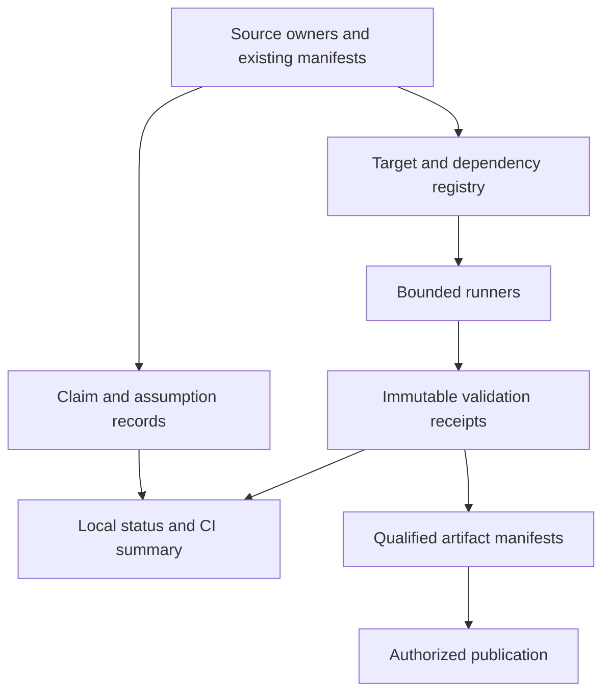

# Emdash DevOps Consolidation Review

Date: 2026-09-23
Status: review complete; implementation stages below are proposals, not selected work.

The [broader reassessment](#broader-repository-and-ecosystem-reassessment)
below reviews the post-implementation state at `2248ae2e`, sibling projects,
local research resources, context noise and the longer-term design. The
original stages are only partly complete. No full aggregate is selected now.

Continuation: the user subsequently authorized implementation. The
[active ledger](EMDASH_DEVOPS_CONSOLIDATION_IMPLEMENTATION_PLAN.md) records
the selected bounded scope and qualification; [DEVOPS.md](DEVOPS.md) is the
current command guide. Findings below describe the reviewed baseline.
Reviewed baseline: local `main` at `44f50587`, initially clean and four commits
ahead of the local `origin/main` tracking ref. No remote refresh was performed.

This review concerns repository development, mathematical validation, evidence,
agent handoffs, and publication. It does not change mathematical scope or reopen
the deferred Op/profile, six-term comparison, or spectral work. Other documentation
edits appeared during the review and were left untouched.

User constraint: the pre-existing emdash book design, architecture and
implementation are the basis for every book-related recommendation. External
textbook projects supply ideas to adapt within those owners.

The governing instructions remain [root AGENTS](../AGENTS.md),
[Lambdapi AGENTS](../emdash2/AGENTS.md), and
[print AGENTS](../emdash2/print/AGENTS.md). This review extends the operational
analysis in the [September reassessment](TYPESCRIPT_EMDASH_FOUNDATIONS_DEVOPS_AND_CONTINUATION_REVIEW.md).
The [earlier MathOps plan](../emdash2/reports/REPORT_EMDASH_MATHOPS_DEVOPS_IMPLEMENTATION_PLAN_2026-06-16.md)
is completed history; its implemented catalog, health, audit, and recovery tools
are the starting point here.

## Assessment

The highest-value work is to consolidate check selection, execution, and evidence
around the existing tools. Emdash has substantial local validation and unusually
explicit research qualifications. Its operational contracts have become spread
across scripts, package commands, registries, plans, and publication workflows.
That creates avoidable uncertainty about what a command checks and what a saved
success actually covers.

There are concrete issues to address before adding more agent orchestration:
ordinary checker paths do not consistently use the resource guard; an imported
LP dependency is absent from the health content snapshot; two focused TypeScript
test files are outside the aggregate runner; and the checked-in GitHub workflows
do not provide general pull-request validation.

The longer-term opportunity is a connected account of each mathematical claim:
its source, formal owner, assumptions, computational profile, checks, review,
and published artifact. Most of the ingredients already exist. Build adapters
and generated views over them before introducing another database or goal system.

## Existing strengths to preserve

| Area | Existing foundation | Consolidation should preserve |
| --- | --- | --- |
| Workspace | Pinned pnpm, shared lock, worktree bootstrap, workspace contract | Four contributor packages; independent mutable dependency graphs per worktree; the standalone template's intentional npm lock exception |
| Mathematical review | Owner-position probes, subject reduction, negative controls, warning-family review | Semantic review in addition to passing checks; no automatic zero-warning rule |
| Resources | Serial resource guard, measured GC profiles, selected deadline/memory extensions | Default 2 GiB/90 seconds and explicit exceptional profiles, applied per invocation |
| Inventories | Check catalog, source TOC, health snapshots, report lifecycle checks | Stable IDs and source ownership; generated reports remain generated |
| Proof product | Explicit Core, exact source replay, theorem dependency checks, semantic diff, repair proposals | Small browser-safe checker and its bounded transferred profile |
| Publications | Book/document manifests, evidence links, render/PDF gates, checked artifact promotion | Local fonts, deterministic metadata, exact artifact identity, renderer ownership |
| Package release | Tag/ancestry preflight, verified tarball, isolated publish job, provenance | Publish the same verified bytes; keep source execution out of the publish job |
| Recovery | Living plans, audit recipes, exact-response archive | Active source and current decisions outrank chronological logs |

These are substantial assets. The strongest existing package workflow is a useful
internal model for the other publication paths:
[npm-publish.yml](../.github/workflows/npm-publish.yml).

## The existing emdash book is the architectural starting point

The [book workspace](../emdash2/book/README.md) already has a theorem-led spiral,
chapter-sized source, conceptual ownership, formal-status distinctions, provenance,
an evidence appendix, deterministic assembly and a qualified publication pipeline.
Its current source manifest identifies edition `0.9.2-dev`. Those capabilities
are existing implementation, not work to be introduced from Lean tooling.

| Existing owner | Responsibility to retain |
| --- | --- |
| [book.json](../emdash2/book/book.json) | Metadata, source order, render input and artifact target |
| [expansion.json](../emdash2/book/expansion.json) | Chapter-group architecture, conceptual owners, central claims, terminology and translation contracts |
| [STYLE.md](../emdash2/book/STYLE.md) and chapter sources | Exposition, formal-status conventions and source-owned prose |
| [evidence.json](../emdash2/book/evidence.json) | Existing claim IDs, statements, formal owners, reviewers and the four formal-status categories |
| [Source provenance](../emdash2/book/references/third-party-sources.json) | External revisions and adaptation attribution |
| [documents.json](../emdash2/print/documents.json) and the [shared pipeline](../emdash2/print/src/pipeline/commonMarkdownPipeline.tsx) | Registered loading, Markdown/KaTeX/Arrowgram rendering, sanitization and pagination |
| [RELEASE.md](../emdash2/book/RELEASE.md) and existing release scripts | Clean-install, browser, PDF, visual-review and promotion requirements |

The proposed addition is operational linkage: associate existing evidence IDs
with exact execution receipts and artifact provenance, and derive useful views
from that linkage. A chapter-to-claim view should read the existing architecture
and evidence manifests. It should not require a second manually maintained
blueprint, chapter taxonomy or status vocabulary. Source-linked runnable examples
are a later authoring enhancement only where they improve the existing book.

No adoption of Verso, MkDocs or Lean Blueprint as the book implementation is
proposed. The current renderer and pedagogical architecture remain the baseline.

## Findings from the current repository

### F1. Resource policy and execution paths disagree

[probe.sh](../emdash2/scripts/probe.sh) invokes the
[resource guard](../emdash2/scripts/lambdapi_resource_guard.sh), which requires its
tools, takes a serial lock, enforces memory/file/core limits, and uses a hard
deadline. Its systemd mode additionally constrains aggregate descendant memory
and swap; the prlimit fallback is explicitly weaker.

The ordinary paths in [check.sh](../emdash2/scripts/check.sh),
[check_examples.sh](../emdash2/scripts/check_examples.sh),
[check_warning_summary.sh](../emdash2/scripts/check_warning_summary.sh), and
`check_metrics.py:run_command` instead use `timeout --signal=INT` without a hard
kill escalation. They also permit direct execution when `timeout` is missing.
They do not themselves apply the guard's memory or serialization policy.

The TypeScript [probe adapter](../src/v3_2/probe.ts) independently spawns Lambdapi
with a millisecond timeout and `SIGINT`. Consolidation must cover this adapter
too, without adding an OS-process dependency to the browser-safe checker.

There is also routing drift: the health runner selects the registered 6 GiB/180s
native-snake pair wrapper for `examples/freyd_native_snake_pair_exactness.lp`,
while `check_examples.sh` sends that reviewer through its ordinary path.

Recommendation: make every repository checker adapter resolve the same named
target profile and use one bounded execution contract. Retain special staged
object builds, applying the guard to each child invocation rather than wrapping
an entire group around another locked guard. Record the effective backend and
limits. A missing guard facility should fail explicitly.

The existing resource/profile test files under `emdash2/scripts/` are useful,
but the explicit unit-test list in [Makefile](../emdash2/Makefile) does not run
`test_lambdapi_resource_guard.py`, `test_native_snake_pair_profile.py`, or
`test_native_snake_gc_profile.py`. Syntax compilation does not execute them.
Include them in the appropriate tooling gate when consolidating dispatch.

### F2. Saved health evidence does not fingerprint every imported source

[check_metrics.py](../emdash2/scripts/check_metrics.py) registers 746 root LP
targets and 546 reviewer files, for 1,292 files. There are 747 root LP files.
The extra file is
[emdash3_2_prof_reindex_terminal_normalization.lp](../emdash2/emdash3_2_prof_reindex_terminal_normalization.lp).
It is a real current owner, named in the architecture report and imported by
the registered
[prof_reindex_terminal_normalization reviewer](../emdash2/examples/prof_reindex_terminal_normalization.lp).
It is also directly listed by `check.sh`.

`check_content_snapshot` hashes the registered file list, not a resolved import
closure. Consequently a change confined to that imported owner does not change
the health content digest. Under otherwise identical identity fields,
`--resume` can accept predecessor success for a reviewer whose dependency has
changed. This is a source-level finding; the review did not modify the owner or
run a stale-cache experiment.

The existing identity already includes useful flags, GC settings and hashes of
the guard and two special wrappers. It still uses a Lambdapi version string and
does not hash all isolated-group scripts, the runner implementation, package
resolution configuration, or a resolved artifact/dependency environment.

Recommendation: fix dependency completeness before making caching more
aggressive. Include the exact transitive source closure, resolution configuration,
relevant runner/tool identity, and any compiled-object provenance. An unresolved
dependency must make evidence non-reusable. Keep only successful checks reusable;
keep failed attempts separately for diagnosis.

### F3. Check membership needs an executable contract

The direct target list in `check.sh` contains 589 entries, while the health list
contains 746. There are 158 health-only entries and the one check-only owner
described above. Different focused and integration suites can legitimately have
different membership; these counts do not establish that 158 modules are
unchecked, since imports also check dependencies. They do establish that command
scope cannot be inferred from a single maintained list.

Several isolated-chain membership sets and dispatch decisions are repeated in
shell and Python. [Book evidence validation](../emdash2/scripts/check_book_evidence.py)
even derives its active-owner allowlist by regex-scanning `check_metrics.py`.
An operational Python implementation has become a cross-language data registry.

The TypeScript aggregate has 446 direct test imports. A transitive import walk
accounts for indirect research-goal and benchmark tests, but still leaves these
two files unreachable from [main_tests.ts](../tests/main_tests.ts):

- [v3_2_pathout_presentation_proposal_tests.ts](../tests/v3_2_pathout_presentation_proposal_tests.ts)
- [v3_2_pathout_presentation_review_tests.ts](../tests/v3_2_pathout_presentation_review_tests.ts)

Their [owning plan](TYPESCRIPT_ELABORATOR_V3_2_PATHOUT_STANDARD_LIBRARY_PLAN.md)
describes them as focused proposal/review tests. Classify and register them, or
record a deliberate separate gate. Do not silently assume all test-shaped files
belong in the same expensive aggregate.

Recommendation: one declarative target/profile registry, with generated command
membership and cross-language readers. Validate reachability, duplicate IDs,
unknown targets, import coverage, and explicit exclusions. Distinguish owners,
reviewers, non-library audits and historical fixtures. Start with operational
metadata; do not duplicate mathematical declarations in the registry.

### F4. Local validation is much stronger than checked-in hosted CI

The only workflows in the root `.github/workflows/` are
[Pages](../.github/workflows/pages.yml) and npm publication. Neither provides a
general `pull_request` gate.

Pages installs the standalone template and runs `npm run build`. That command
is `vite build`; the template's separate `check` also invokes TypeScript. The
workflow does not run root tests, conformance, kernel validation, or publication
evidence checks. The npm workflow has strong artifact handling, but does not run
the root behavior-test suite or lint as part of its release build.

The root `check:all` runs `check:ts`, the selected MVP conformance command, and
`make -C emdash2 ci`. It does not include packed-package checks, browser rendering,
PDF release validation, or every opt-in directed/scale conformance suite. Its
name should not be treated as proof that every shipped boundary was tested.

Recommendation: publish an explicit gate matrix and make hosted CI execute it.
Use a stable required summary job that explains which gates ran, which were
reused, which were out of scope, and which remain missing. Use the same selection
logic locally and in CI. Missing required checks must fail rather than become
green skips.

Private repository rulesets, environment approvals, npm account settings, and
live workflow history were not audited. This finding concerns checked-in
workflows and command definitions, not the absence of all external protection.

### F5. Source freshness, successful checks, and mathematical review need distinct status

The current committed health report is source-current: the read-only snapshot
check passed. Its timing rows have blank exit/duration fields while their
evidence column says `current`. That is what `--no-check` produces. It is a
source inventory, not a fresh successful typechecking receipt. Likewise, the
book evidence checker validates references and ownership; it does not execute
the cited formal claims.

Both are useful checks. Their results should be presented with explicit kinds:
inventory-current, passed-fresh, passed-reused, failed, timeout, resource-limit,
not-run, and out-of-scope. An expected negative audit needs its own expectation
and observed outcome; an arbitrary checker error must not satisfy it.

Mathematical status is a separate axis. The
[current Foundations](../emdash2/reports/EMDASH_FOUNDATIONS.md) and
[README boundaries](../README.md#current-boundaries) document known
variance/soundness defects and restricted interpretations. A successful check
in that research theory is not a consistency certificate. A green dashboard
must retain the theory revision, profile qualifications, supplied model
contracts, and unresolved semantic boundaries.

### F6. Reproducibility and publication can be connected more tightly

Contributor JavaScript dependencies are pinned well. The bootstrap does not
install a pinned Lambdapi/OCaml toolchain. The older MathOps plan explicitly
chose to record a development build without enforcing it, to permit exploration.
That is a reasonable exploratory policy, but a reproducible CI/release lane
needs a precise toolchain recipe and machine-readable identity.

Use a pinned verification environment and allow separately labelled exploratory
environments. A doctor command should report required versions and tools,
including resource-guard capabilities, Python, Chromium, qpdf and Poppler where
relevant. A container is one possible packaging choice, not a prerequisite for
the first consolidation tranche.

The book promotion script already verifies copied bytes and PDF checks validate
metadata/content. Extend this with a durable manifest binding source closure,
book/document manifest, renderer/browser versions, validation receipt, PDF,
Markdown and deployed bundle digests. A successful copy or Pages build is not
itself that source-to-publication linkage.

The npm workflow's exact verified artifact is the pattern to reuse. Pages can
adopt its job-scoped permissions, pinned action identities, explicit job budgets,
and validation-to-deploy dependency. Test the package's advertised Node consumer
floor separately from the newer contributor pnpm requirement. Publication remains
a distinct authorized action after validation.

### F7. Navigation and test cost are measured maintenance work

The initial review snapshot had a 3,005-line elaborator handoff, 740-line nested
AGENTS file and 1,344-line report index. The September reassessment already
recommends separating current routing from chronology. Follow that recommendation:
short contributor entry points, one current status owner, explicit active/deferred/
completed routes, and linked historical receipts.

The [test-performance plan](TYPESCRIPT_TEST_PARALLELISM_PLAN.md) contains useful
July measurements: a fair two-worker comparison was slower than a shared-process
control; duplicate immutable compilation and eager fixtures dominated several
costs. Those are historical measurements, not a fresh timing of today's larger
suite. Reconfirm the expensive paths before implementation.

Prioritize successful immutable-result caching, lazy fixtures, then compiled-JS
or qualified lighter runtime execution. Only then consider small dependency-aware
shards. Preserve serial Lambdapi execution and aggregate import-interaction
checks. A large number of CPU cores does not justify many duplicate checker heaps.

## What to adapt from the comparison projects

Sources were inspected on 2026-09-23. These are design references, not dependencies
installed or services used for submissions. The user confirmed Verso, Lean
Blueprint and Mathematics in Lean as representative textbook examples.

| Project and observed practice | Useful adaptation to emdash |
| --- | --- |
| [Prove2Me](https://prove2.me/about) separates immutable targets from proofs and decomposes missions through dependency-linked sketches. Its [public description](https://prove2.me/) identifies Formalpedia as the reusable results library. | Stable claim identities, exact target matching, alternative proof decompositions, and a searchable verified-result view. Reuse the existing theorem DAG and replay mechanisms. Audit definitions and permitted rule environments as well as the headline claim. |
| [Palomar](https://palomar-registry.org/about) records pinned repository snapshots, statement/proof comparison, independent checking, and separately described informal correspondence review. | Release receipts tying a precise claim to exact source, checker and dependency identities. Keep proof checking and mathematical correspondence review visibly separate. Lean Comparator and its independent kernels are not drop-in validators for Lambdapi or emdash Core. |
| [Lean Pool](https://github.com/Vilin97/lean-pool/blob/main/CONTRIBUTING.md) uses project/challenge registries, fixed challenge statements, deterministic gates, provenance and per-project builds. | Explicit manifests, protected target contracts, focused local gates and integration checks. Adapt the admission rules to our primitives and rewrite theory; a literal Lean axiom whitelist or zero-warning policy would be inappropriate. |
| [TheoremDB](https://www.theoremdb.org/how-it-works/) relates statements, attempts, evidence and revisions, distinguishing exact from advisory structural matches. Its [agent documentation](https://www.theoremdb.org/docs/) asks for durable source identity and useful failures with retry conditions. | Index compact experiment outcomes and replay triggers from existing audits. Keep structural retrieval advisory and replay candidates in the exact current environment. Retain timeout/allocation results as resource observations. |
| Current [AutoformBot main](https://github.com/facebookresearch/autoform-bot) uses Markdown roadmaps, validated dependency links, generated views, doctor/audit commands and review preparation. Autonomous orchestration is a separate `execution` branch. | A small validated roadmap/target vocabulary and generated views fit the repository well. Keep coordination optional. Its lexical declaration lookup is explicitly distinct from compilation; preserve that distinction in our own evidence UI. |
| [ATLAS v1](https://github.com/facebookresearch/atlas-lean/blob/main/v1/README.md) associates textbook targets with evaluation reports and browsable formalizations. The [current root](https://github.com/facebookresearch/atlas-lean/blob/main/README.md) preserves v1 while preparing v2. | Show book claim, formal owner, computational checks and review qualifications together. Measure covered claims and reusable interfaces, not just declaration or line counts. Keep automated faithfulness scores advisory. |
| [Verso](https://verso.lean-lang.org/) integrates checked examples with documentation. [Lean Blueprint](https://github.com/PatrickMassot/leanblueprint) connects exposition, declaration names and dependencies. [Mathematics in Lean](https://github.com/leanprover-community/mathematics_in_lean) pairs sections with runnable examples and exercises. | Link execution receipts to emdash's existing evidence IDs. Derive optional views from its existing chapter architecture and evidence registry. Consider source-owned runnable examples where useful; preserve the established book implementation. |

The research-kernel distinction is decisive. These Lean workflows generally
formalize statements within a pinned logical environment. Emdash also evolves
declarations, runtime rewrites, proof-time agreements and their interpretations.
A proof task should hold its theory/profile contract fixed. Changing that
contract is a different review task and must not count as solving the original
proof obligation. This also applies to supplied proof–CAS model contracts.

## Proposed operating model

Use a thin repository tooling layer over the existing owners:



The target registry owns operational facts: target ID, source/input resolution,
dependencies, execution adapter, profile and applicable gates. Mathematical
signatures remain in source. Book order remains in `book.json`, pedagogical and
conceptual structure in `expansion.json`, and claim identity in `evidence.json`.
Document allowlisting remains in `documents.json`. Existing manifests should
reference stable IDs rather than copy each other's data.

A receipt should capture:

- Target ID, schema version, actual command, working directory and run identity.
- Exact source/dependency contents, including dirty/untracked inputs when used;
  commit SHA alone is insufficient for a local experiment.
- Checker/tool/runtime and runner identities, effective flags, GC, timeout,
  memory/file limits and guard backend.
- Fresh or reused execution, exit classification, wall time, observed peak RSS
  when available, warning inventory and raw-log/artifact digests.
- For reuse, the predecessor receipt and exact invalidation rationale.

Never fabricate a per-target measurement by presenting an apportioned group time
as measured wall time. The current health runner already labels isolated-group
time shares; retain that distinction in the schema. Do not equate heap allocation,
heap size, process RSS and aggregate descendant memory.

Extend or project the existing claim records to link the informal assertion,
exact formal target, semantic owner, prerequisites, profile/assumptions, positive
and relevant negative consumers, and review evidence. Record whether the owner
is a derived definition, declared structural operation, runtime computation or
proof-time comparison. Validation, semantic qualification and publication are
separate fields.

Build on [research_goal_graph.ts](../src/v3_2/research_goal_graph.ts),
[lf_development_diff.ts](../src/v3_2/lf_development_diff.ts),
[lf_proof_maintenance.ts](../src/v3_2/lf_proof_maintenance.ts),
[the benchmark evaluator](../src/v3_2/lf_proof_agent_benchmark.ts), and the current
workspace/source contracts. They already distinguish advisory proposals and
fresh proof replay. The research graph explicitly does not authenticate people,
compute cryptographic hashes, or perform I/O. Put receipt acquisition and identity
verification in an outer adapter; do not quietly grant those guarantees to the
pure graph or force build jobs into theorem nodes.

Illustrative future developer commands could be `scripts/emdash dev doctor`,
`dev targets`, `dev check --explain`, and `dev status`. These commands do not yet
exist. Keep existing Make/pnpm entry points as adapters during migration, and
keep basic diagnostics inexpensive to load.

## Gate selection and evidence reuse

| Change boundary | Required intent |
| --- | --- |
| Documentation/plan only | Exact diff, local links and the owning document checks; no unrelated semantic aggregate |
| TypeScript behavior | Focused tests plus typecheck/lint; one full `check:ts` at the required shared-behavior tranche boundary |
| Workspace/package setup | Existing workspace/typecheck/test requirements and affected print checks; packed consumer tests for distribution changes |
| Lambdapi semantics | Owner-position controls, bounded focused checks, warning comparison, affected reviewers, catalog/health synchronization, and full CI where the SOP requires it |
| Renderer/book | Existing owning source, typography, browser and artifact gates according to the print SOP |
| Cross-layer integration/release | Explicit union of affected product, formal, package and publication gates; exact artifact/source receipt |

The matrix should become executable without weakening the existing policy.
Begin with coarse conservative groups. Source imports alone may underdescribe
rewrite interactions: changes to shared rule environments, checker semantics,
registry logic or toolchain identity should widen invalidation. Preserve joint
import tests at integration boundaries. Keep the TypeScript transferred-profile
conformance inventory explicit; a selected MVP differential run does not qualify
every Lambdapi module.

Scheduled checks can test toolchain upgrades and catch broader drift. They do
not replace required pre-integration semantic gates. Expensive successful
evidence may be reused only with a validated closure and matching environment,
not merely because the previous commit was green.

## Proposed implementation sequence

No row below is implementation authorization or a new persistent goal.

| Stage | Bounded deliverable | Acceptance evidence |
| --- | --- | --- |
| 0. Close inventory gaps | Resolve the missing health dependency; classify the two TS suites and unwired resource tests; document command scopes | All current owners/reviewers/tests are reachable or explicitly classified; changing any dependency invalidates affected reuse; no mathematical edits |
| 1. Consolidate one execution slice | Named profiles and receipt schema for an ordinary check, an imported reviewer, and an existing exceptional native target | Existing commands select the same effective policy; hard deadline/limit/failure tests pass; each actual invocation is bounded; raw diagnostics and subject reduction retained |
| 2. Add reproducible CI | Pinned verification recipe, doctor output, shared gate selector, PR summary and artifact retention | A clean CI checkout reproduces selected gates; missing required checks fail; changed shared owners widen scope; release/deploy consumes matching validated artifacts |
| 3. Consolidate navigation and claims | Short handoff, current status owner, linked history; one claim-to-source-to-receipt view from book evidence | Each displayed status has an identifiable source; no manual second status database; theory limitations and supplied contracts remain visible |
| 4. Reduce measured iteration cost | Reconfirm hotspots; cache immutable compilation, defer fixtures, qualify test runtime; split diagnostic groups where justified | Equivalent test/check inventory, preserved negative controls and joint imports, recorded time/memory improvement; shard only if measurements justify it |
| 5. Add optional coordination | Compact task packets, experiment retrieval, work claims and integration queue if concurrent work warrants them | Each packet fixes target/theory/scope and budgets; stale claims expire; submissions replay at integration; agents cannot self-certify semantic promotion |

For Stage 1, use the existing resource limits and narrowly selected consumers.
Migrate one wrapper at a time, retaining equivalent bounded legacy adapters
while the shared route is qualified. Select proportional validation in its
implementation plan; do not run the 1,292-file gate after every
metadata edit. Shared TypeScript changes still receive their required final
aggregate, and substantial semantic changes still receive the nested SOP gates.

Diagnostic splitting is separate from a nucleus reorganization. The existing
catalog's mathematical areas can supply stable groups, but every assertion must
survive exactly once and an aggregate interaction target must remain. Moving
Lambdapi declarations changes qualified identities, linkage and rewrite
environments; defer that migration to its mathematical/dependency plan.

An initial coordination packet can remain a small tracked record: exact base and
target, source owner, allowed files, active decision links, expected positive and
negative checks, named resource profile, outcome, and retry trigger. Reuse the
existing plan/archive hierarchy. TheoremDB-style failure retrieval should prevent
repeating unchanged dead ends, while allowing reconsideration when a recorded
prerequisite changes. Persistent process state is not proof authority.

The useful metrics are selection accuracy, required-test coverage, receipt
completeness, time to a focused verdict, gate wall time and memory, explicit reuse
rate, repeated-failure cost, and publication/source mismatches. Baseline them
before setting targets. Raw theorem counts and automated review scores should
not serve as the primary progress measure for an evolving foundation.

## Review evidence and limits

Executed during this review:

- `node scripts/check-workspace.mjs`: passed; pnpm 11.16.0, Node 24.11.1.
- `python3 emdash2/scripts/check_metrics.py --no-check --check-report --brief`:
  passed for 1,292 registered files; Lambdapi checks explicitly skipped.
- `python3 emdash2/scripts/generate_check_catalog.py --check --strict`: current.
- `python3 emdash2/scripts/lint_report_headers.py`: passed.
- `python3 emdash2/scripts/check_book_evidence.py`: passed, 187 claims and 187
  cited evidence IDs; reference validation only.
- From `emdash2`, `python3 -m unittest tests.test_check_metrics`: 26 tests passed.
  Printed timeout examples came from mocked failure cases, not real checker runs.
- Static target-list comparison, transitive TypeScript test-import inspection,
  workflow/command tracing, and the primary-source comparisons linked above.

No full TypeScript/kernel aggregate, new performance benchmark, browser render,
PDF build, independent mathematical audit, or hosted-service implementation
audit was performed. No external proof submission, package installation, Git
checkpoint, branch/worktree change, push, deployment or publication was made.
The new review file passed scoped diff/whitespace inspection and validation of
38 local links, referenced heading anchors and balanced code fences.

## Broader repository and ecosystem reassessment

Date: 2026-09-23. Reviewed main: `2248ae2e`, seven commits after milestone
`f76e8ac9066dc7cf8f3ed90cba42a5eea92b742e`. The five documentation commits
are reconciled in the implementation ledger; `f9ae8d6a` implements the bounded
DevOps tranche and `2248ae2e` records source requalification and performance
repairs. The working tree and all 63 registered emdash worktrees were clean
before these documentation edits. Remote refs were not refreshed.

The next priority is **current guidance, document ownership and retrieval**.
The repository already has enough execution machinery for this next tranche.
Keep the existing book, mathematical owners, checker and platform boundaries;
reduce the amount an agent must read to understand which rules apply.
This reassessment updates the earlier proposals; it does not launch a new
mathematical goal, sibling integration or repository-wide redesign.

### Completion of the original plan

| Original stage | State at this review | Remaining boundary |
| --- | --- | --- |
| 0. Inventory gaps | Implemented | Maintain the registries through their existing owners |
| 1. Execution and receipts | Implemented; focused qualification recorded | Broader execution evidence remains bounded by the ledger |
| 2. Reproducible CI | Implemented and locally tested | Clean hosted toolchain/run and new Pages activation remain unqualified |
| 3. Navigation and claims | Partial | Contributor guide and existing-book evidence projection are present; short handoff, consolidated current status and linked history are still outstanding |
| 4. Measured iteration cost | Partial | Matcher and immutable signature-reference repairs are focused-green; minimal progress reporting and eventual full-runtime calibration remain open; diagnostic splitting is unselected |
| 5. Optional coordination | Unselected | No present need establishes the value of another queue, database or orchestration service |

Thus the implementation ledger's completed DEVOPS-3 row has a narrower scope
than original Stage 3. It must not imply the whole consolidation is finished.
The [profile/performance ledger](TYPESCRIPT_PROFILE_AND_PERFORMANCE_REPAIR_PLAN.md)
owns the exact source comparisons, preserved historical audits and focused
test results. The last aggregate was incomplete at its one-hour limit; that
limit was a provisional resource budget, not a measured normal duration or
proof of a hang. Samples showed changing work and sustained CPU activity.
No reported failure in a partial run is not a full-suite pass.

The user explicitly declines a full run now. Carry that incomplete status
forward. When test observability is next selected, add execution-order
start/completion information, durations and a lightweight parent heartbeat
to the existing runner/log. Prove it on a small controlled workload. Do not
start a full run, increase the deadline, add a monitoring service or tune
concurrency merely to complete this documentation review. A later authorized
calibration can decide whether the routine aggregate needs a different budget
or structure. Required integration qualification remains visible until then.

### Context noise and document ownership

At the reviewed commit there are 311 tracked Markdown files, approximately
311,000 lines / 16.6 MB. The generated `docs/emdash-book.md` contributes about
20,500 lines, but most of this total is other prose. The elaborator handoff
has 3,015 lines, the report index 1,351, the current architecture/SOP report
3,281, and Foundations 7,658. Several completed living plans exceed 5,000
lines. File size alone is not a defect; repeating chronology in entry points
and labeling dated states "current" makes retrieval unreliable.

Ignored logs, caches and response archives are already largely excluded from
ordinary search. The main remaining source of noise is tracked historical
prose mixed with current guidance, plus generated publication copies. A
blanket ignore of `docs/` or `reports/` would hide essential qualifications.

| Owner | Recommended disposition |
| --- | --- |
| Root and nested AGENTS | Keep mandatory rules and short task routes. Move long status/owner narration to its existing authoritative document; do not drop mathematical qualifications or resource rules |
| Elaborator handoff | Replace chronological accumulation with a few screens of current target, trusted boundary, task routes, validation status and immediate deferrals; link preserved history |
| Current architecture report and Foundations | Architecture report owns exact implementation/profile status; Foundations owns mathematical explanation. Remove duplicated milestone narration only after checking the actual owners and retaining assumptions |
| Report index and completed plans | Short current index with active/deferred/completed routes. Preserve decision summaries, counterexamples and replay/reopen conditions; move dated receipts out of normal entry-point reading |
| Generated book/health/catalog artifacts | Keep their owning generation/publication contracts; search chapter or generator sources by default. Exclude generated copies only through narrow, documented search rules |
| Old experiments and sibling templates | Classify use, integration state and unique evidence before retirement. Age or an older package pin alone is not a reason to delete |

Prefer a tracked, explicitly historical location for decisions needed by other
contributors, or a short durable summary with an exact Git commit/path. The
ignored `.scratchpad` is appropriate for replaceable local debris; it should
not become the only copy of a counterexample, migration rationale or replay
recipe. No blanket move into it is recommended, and its contents were not
inspected during this review.

Use scoped searches immediately, before reorganizing hundreds of source files:

```bash
# Replace OWNER with the declaration or family being investigated.
rg -n 'OWNER' emdash2/emdash3_2*.lp
rg -n 'OWNER' emdash2/examples -g '*.lp'
rg -n 'OWNER' src/v3_2 tests -g '*.ts'
rg --files docs emdash2/reports -g '*UNIVERSALITY*'
rg -n 'OWNER' emdash2/book/chapters -g '*.md'
```

Search historical ledgers explicitly when current owners link to a decision.
After history is actually separated, a short `.rgignore` for unequivocal
historical/generated duplicates may help; document an explicit search path
that includes them. Do not build a custom search service or hide active plans.

### Keep mathematical discipline visible without another rulebook

The [formal SOP](../emdash2/AGENTS.md) already contains the important guidance.
Its [synthetic interfaces](../emdash2/AGENTS.md#synthetic-computational-interfaces),
[generic owners](../emdash2/AGENTS.md#generic-owners-and-higher-structure),
[rule hygiene](../emdash2/AGENTS.md#rewrite-and-unification-hygiene) and
[diagnostic/resource procedure](../emdash2/AGENTS.md#avoid-hung-typechecks)
should remain the rules, with a compact orientation at the task entry point:

- Construct whole functors, transfors and universal operations first; retain
  higher action and actual comparison/inverse data. Component observations
  and ordinary CAS witnesses have legitimate downstream roles.
- State the strict/lax/pseudo or ordinary/groupoidal profile. Whole structure
  does not imply strictness, and current prototype rules are not an unrestricted
  foundation. Distinguish supplied assumptions from constructed data.
- Separate declarations/axioms, runtime computation, proof-time agreement and
  checked theorems. An agent must not change the permitted theory to count an
  original proof obligation as solved.
- Preserve generic `fapp`/`tapp` ownership. Investigate full owner-position
  interactions before adding constructor-specific coherence rules, broad eta,
  injectivity or commuting conversions. Retain intentional matching guards.
- Test proof-time unification with typed consumers such as `eq_refl`, alongside
  no-unifier and runtime controls where applicable. A conversion assertion is
  not automatically the same experiment. Warnings require overlap analysis.
- Diagnose import, formation, construction and actual consumption separately.
  Keep positive and negative controls, bounded serial runs and exact profiles;
  resource failure alone does not establish a mathematical impossibility.

This list is a consolidation criterion, not an additional mandatory document
to read before every edit. Keep the actual rules in AGENTS and technical detail
in their linked owners. A useful autonomous task packet can be one short plan
section: fixed theory/profile, target, owner, assumptions, positive/negative
consumers, budget, decision links and stopping/reopen condition. No new packet
schema, theorem ontology or agent-control service is needed now.

### Sibling projects and the earlier product drift

Read-only inspection covered CloserFans `master` at `a03c667a`, its two Emdash
benchmark/canary worktrees, and Arrowgram `main`. CloserFans has an unrelated
modified CRM report, which was preserved. The inspected benchmark/canary
worktrees and Arrowgram working tree were clean. No hosted runtime was checked.

The ownership boundary should be simple:

| Project | Owns | Integration contract |
| --- | --- | --- |
| Emdash | Mathematical theory, explicit Core/checking, authoring, proof–CAS contracts and its book | Versioned package or exact repository source; freshly checked proof/artifact evidence |
| CloserFans | Workspaces, identity, persistence, collaboration and publication services | Thin adapters around those Emdash commands/artifacts; no copied mathematical authority |
| Arrowgram | Diagram/document representation, rendering and editor tooling | Typed views of source-owned data; a diagram or publication event does not certify a theorem |

CloserFans has three different Emdash examples, not three interchangeable
versions of one template:

| Local template | Current role and pin | Recommendation |
| --- | --- | --- |
| `templates/emdash_ts/` | Simple source-editable proof starter, Emdash `0.1.0`; main has a runtime verifier | Keep the essential edit/goals/check/verify loop; simplify boilerplate when selecting its usability tranche |
| `templates_artifacts/emdash_goal_graph/` | Optional read-only goal/diagram publication, Emdash `0.2.0` | Retain as an optional projection if used; theorem, task and approval evidence stay distinct |
| `templates/emdash_benchmark/` | Developer evaluation fixture, Emdash `0.3.0` | Keep out of the default mathematics workflow; resolve its integration state before deciding whether to maintain or retire it |

The benchmark has a concrete reconciliation issue: main contains the template
from `4550382b`, but not `scripts/verify-emdash-benchmark-template-runtime.ts`.
The completed recovery worktree at `cbf23566` is not an ancestor of main; its
scoped difference contains that verifier and deterministic ordering corrections
in the source/adapter. This is evidence to review, not permission to merge a
whole old branch or silently call main fully qualified.

The separate canary worktree is at `1074fc75`. Its terminal experiment was
explicitly **parked** in the
[benchmark plan](TYPESCRIPT_EMDASH_PUBLIC_PROOF_AGENT_BENCHMARK_PLAN.md#terminal-v4-result-and-benchmark-stream-refocus):
the command audit failed, there was no proof-source change, and no proof
performance result was established. Preserve the compact decision and concrete
reopen trigger; do not revive the harness, retry classifier or general goal
platform merely because this review mentions it. Its private raw artifacts
were not needed or read.

The platform's September 1 Emdash1 book-workspace correction plan also records
a past wrong-repository review: `/home/user1/emdash` was mistaken for
`/home/user1/emdash1`. The old page/chapter acceptance was withdrawn. Preserve
the native emdash book pipeline and adapt generic platform publication around
it; no new Lean/Verso/Markdown-book migration follows from the comparisons.

Arrowgram's local core is `2.0.0-rc.0`, while Emdash print and the graph template
pin `1.0.0`. These are observed version boundaries, not proof that the consumers
are broken. Upgrade only for a concrete benefit with the affected render/schema
checks. Keep Arrowgram's private service material outside Emdash's public docs.

### Local literature and implementation references

The new [local resource index](../emdash2/research/LOCAL_RESOURCES.md) locates
the existing PDF/text collections, two identical CMU spectral checkouts,
HoTT book, Lean and Lambdapi source trees. It links the existing HRI reading
inventory and book provenance rather than introducing another bibliography.
Standalone Agda/Coq research checkouts were not found by the bounded name
inventory; that is not proof they do not exist elsewhere.

The literature workflow and `arxiv_search.py` survived the earlier cleanup.
The missing piece was routing, not a new collection system. The helper searches
and caches arXiv metadata; it is not a PDF downloader. Keep papers external,
record version and actual reading coverage when used, and use PDF/source rather
than extracted text for exact formulas.

Two concrete repairs merit separate small tasks:

1. The HoTT book is a tracked Git link without `.gitmodules`. Move research-only
   acquisition outside the contributor tree, or declare a reproducible submodule
   if an actual build requires it. Preserve existing attribution and pins.
2. The local Lambdapi source HEAD differs from the pinned checker, whose commit
   is absent there. Obtain matching source when a checker investigation needs
   it; do not silently switch the existing reference checkout or change the
   verification toolchain merely to make those two locations match.

No new crawler, PDF hash database, vector index, automatic repository sync or
shared home-directory scan belongs in the first consolidation tranche.

### Ideal design and the cost of changing today's implementation

Record this counterfactual once, then revisit it only when a named limitation
blocks a real consumer. It is a design reference, not a replacement roadmap.

| If starting today | Current constraint | Revisit trigger |
| --- | --- | --- |
| Small explicit Core with sharply bounded checking, profiled mathematical libraries and a clearly delimited conformance oracle | This remains the intended product architecture; active LP theory and bounded TS transfer have different qualification boundaries | A specific library/profile graduation, not desire for a new framework |
| Foundational owners arranged as an acyclic dependency graph with stable semantic identities | LP qualified names, source order and interacting rewrites make file moves semantic/linkage migrations; TS pins and book pointers depend on them | Profile repair and measured dependency/import cost justify a dedicated migration |
| One current status surface per concern, with immutable decisions and receipts reached on demand | Long living plans accumulated chronological state; historical evidence remains valuable | The next documentation tranche, preserving links and recoverability |
| Algebra algorithms produce outputs plus proof obligations/certificates checked against explicit model contracts | Current native bridges already retain presentations and supplied model/normality/interpretation assumptions; they must remain visible | A concrete new CAS algorithm or stronger model qualification |
| Platform and visual clients consume the same source and derived artifacts | Published templates and renderer versions are independent release snapshots | A real onboarding/rendering/integration defect with an affected-consumer test |

Do not turn this ideal into a monorepo merger, new prover, general knowledge
graph, module renaming campaign or replacement book engine. A short decision
record should name the chosen approach, its evidence, accepted limitation and
reopen condition; avoid another running diary of every intermediate attempt.

### Readiness for larger mathematical and community goals

The algebra-proof-assistant direction is coherent: internal universal
constructions and whole categorical action organize the mathematics; exact
CAS algorithms handle concrete presentations; checked bridges relate the two.
The native homology work is substantial evidence for that direction.

However, "architecture settled" must not imply "foundation globally qualified."
[Foundations](../emdash2/reports/EMDASH_FOUNDATIONS.md) records closed-Empty
counterexamples for the current unrestricted Op/Sigma/Homd package. The
completed action-profile branch is still awaiting dedicated integration,
and it does not by itself repair every variance defect. Cleanup and successful
CI cannot discharge those mathematical obligations. Keep bounded ordinary
and supplied-model results explicit while pursuing the separate coherent
profile/variance work before unrestricted higher claims.

For community scale, contributors need to find a target, its exact permitted
theory, a small reproducible example, expected controls and a reviewer-visible
result. Establish that path before adding a marketplace, leaderboard or
autonomous coordination layer. Ordinary usability and qualification work can
proceed in bounded scopes without pretending Lurie's framework is implemented.

After the foundational boundaries are qualified, use concrete vertical
consumers to drive stable/spectral work: a bounded resolution and Ext example,
an exact-couple/spectral-sequence computation with stated convergence scope,
and their whole internal naturality/universal interfaces. Preserve the
distinction between finite CAS calculations and a general stable infinity-
categorical or spectral-geometric formalization. These are candidate milestones,
not newly selected tasks or claims that their missing higher layer is routine.

### Recommended next bounded work

| Order | Deliverable | Completion test |
| --- | --- | --- |
| 1 | Short current handoff and report index; move chronology to explicit history; consolidate current status by existing owner | An agent can locate the current theory/profile, source owner, command, known counterexample and relevant decision without reading a completed ledger; local links and exact document diff pass |
| 2 | Resolve HoTT Git-link ownership and explicitly classify old template/canary material | Ordinary checkout semantics are clear; no lost attribution or unique evidence; no accidental sibling integration/deletion |
| 3 | Minimal test progress/duration reporting, when selected | Small controlled pass/fail/slow workloads make progress and cancellation distinguishable; full aggregate remains deferred until requested |
| 4 | Separately scoped profile/variance qualification and one proof-assistant usability consumer | Existing mathematical/consumer plans determine gates; no semantic promotion through document cleanup |

Diagnostic splitting and nucleus reorganization are deferred pending measurements
and their own acceptance criteria. The earlier proposal to bundle a diagnostic
split with the handoff cleanup is narrowed accordingly. The useful next review
metric is whether onboarding and scoped retrieval are clearer, not how many
files, policies or dashboards were added.

This pass adds the resource locator and repairs documentation routing/scope
statements. It does not perform the proposed bulk history extraction, file
retirement, HoTT relocation, template integration or mathematical repairs.
Validation is documentation-only: exact diff inspected;
`./scripts/emdash dev docs` passed 80 local links across the six changed
Markdown files; 11 heading links and code-fence/whitespace hygiene also passed.
No full TypeScript, formal, cross-layer, browser or hosted aggregate was run,
in accordance with the user's instruction.
