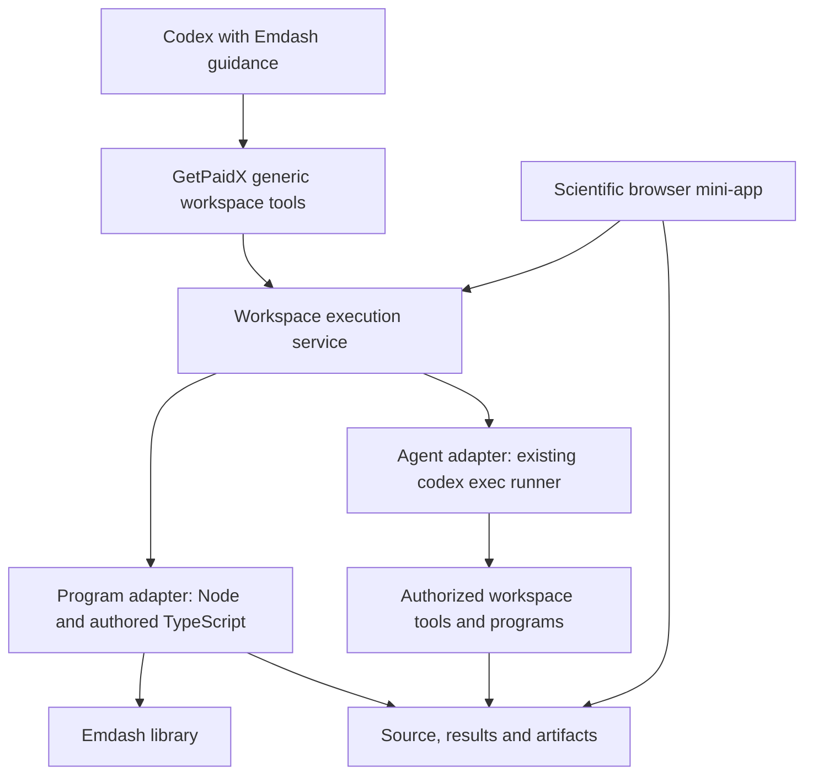

# Emdash Local And Cloud Workspace Implementation Plan

Date: 2026-09-28
Plan-ID: EMDASH-LOCAL-CLOUD-WORKSPACE
Status: active persistent goal; accepted architecture, LC-1 implementation
started in dedicated worktrees
Baseline: Emdash `acb33a29`; inspected GetPaidX `a03c667a` and Arrowgram
`214ec0a`, to be rechecked in their own repositories before edits

This plan resolves the implementation choices left open by the
[strategy](EMDASH_SCIENTIFIC_COMPUTING_STRATEGY.md) and
[execution review](EMDASH_WORKSPACE_EXECUTION_ARCHITECTURE_REVIEW_2026-09-28.md).
The user requests a settled recommendation before starting implementation in
the next turn and has authorized local checkpoints as work progresses.
The earlier GetPaidX immediate-task concern remains an independently useful
platform improvement. Sharing execution infrastructure does not turn Emdash
calculations into mandatory agent delegation.

## Architecture Decisions

1. Emdash's extensible mathematical interface is its TypeScript library and
   ordinary authored programs. Mathematical functions do not become platform
   endpoints or individual MCP tools.
2. GetPaidX supplies a small generic workspace execution service with two
   explicit execution kinds: a program and an instructed Codex task.
3. Both kinds share execution identity, status, output, cancellation and
   resource accounting. Their start requests and implementations remain
   distinct.
4. The first hosted route uses the existing GetPaidX OAuth MCP connection and
   gateway/controller relationship. Use controller-managed processes rather
   than requiring native Codex remote-host enrollment.
5. The scientific browser interface is an ordinary Node mini-app using
   GetPaidX's existing authenticated HTTP/WebSocket proxy.
6. Local and cloud execution use the same Emdash program, mathematical input
   and result formats. The project is durable; the conversation and views
   reference it.
7. Preserve GetPaidX's intentional `codex exec --yolo` execution mode.
   Authorization means the permitted platform principal, session, process
   identity, filesystem access and billing context.

The local equivalent uses a local process adapter over the same project.
No GetPaidX account is required for local mathematics.

## Two Start Operations, One Execution Lifecycle

| Operation | Input and behavior |
| --- | --- |
| Start program | Selected session, program/task reference, parameters, expected source revision and resource profile; executes the program without a model turn |
| Start Codex task | Selected session, instruction string, optional owned resume reference and resource profile; launches the existing non-interactive agent immediately |
| Read execution | Execution ID, optional output cursor and bounded wait; returns state, new output and result/artifact references |
| Cancel execution | Execution ID; requests process-tree termination and reports the eventual outcome |

Use separate curated MCP start tools so the agent can choose between ordinary
execution and delegating instructions. A typed start-request union can share
the underlying API. Working route names are
`/api/workspace/executions`, `/api/workspace/executions/{id}` and
`/api/workspace/executions/{id}/cancel`; check naming collisions before
implementation. These are new proposed routes, not currently callable APIs.

Reuse existing workspace selection/start/close and preview capabilities.
Add bounded generic project-file read/update and artifact access where missing,
with relative paths and expected revisions. Keep the existing Arrowgram source
allowlist as its own contract.

The program adapter initially supports a pinned Node/TypeScript runner and
workspace-declared tasks. The controller resolves the task to an executable
and argument array under the authorized workspace identity. This mechanism
can later support other installed runtimes without adding mathematical methods
to the platform.

One program can perform many algebra operations, construct objects, check
selected Core terms and generate several artifacts. The model learns the
library from its declarations, documentation and examples. Keep large
intermediate values in the worker/workspace and return compact summaries.

### State, Dispatch And Recovery

Use a dedicated generic execution record, separate from the existing scheduled
automation record. The gateway stores the durable receipt; the controller
supervises the process and reports progress/state to that same execution.
The browser and Emdash packages do not own competing queues.

Record the actor, workspace/session, kind, request identity, runtime/resource
profile, timestamps, state and output references. Initial states are:
`accepted`, `running`, `cancelling`, `succeeded`, `failed`,
`cancelled` and `interrupted`.

Dispatch immediately to an already selected, ready workspace. Persist acceptance
before dispatch and use a caller/workspace/kind-scoped idempotency key. A retry
with the same key and different input is a conflict. Resolve an uncertain
launch through the existing execution identity; do not blindly execute twice.

Return an execution ID promptly. Reading progress may use bounded polling;
streaming can remain an implementation optimization. An HTTP/MCP connection
closing does not itself cancel accepted work. Explicit cancellation reaches
descendants. For the initial profile, closing the workspace cancels active
executions; a controller restart marks unrecoverable active work interrupted.
Do not claim automatic program continuation after process loss.

Bound concurrency and resources through advertised workspace execution profiles.
Serialize managed writers to one project initially and reject a conflicting
start as busy. External editor changes still require revision detection; a
service lock does not prevent every filesystem writer.

Scheduled/event-triggered automations retain their existing scheduling and
records. They may reuse the executor later, but migrating the scheduler is not
a prerequisite for immediate execution.

## Project And Mathematical State

Keep readable TypeScript, input data and a pinned dependency/runtime manifest
in the workspace project. Use the platform-resolved persistent data location
for run snapshots, output and caches. A small project manifest names entrypoints,
declared input files and views; it is not a new mathematical language.

For scientific program runs, capture the actual source/input snapshot and
pinned dependencies before execution. A revision comparison alone does not
freeze imports. Run against that snapshot and store output in the execution's
artifact directory. Update a current view only if its expected source revision
still matches. Report exactly what the snapshot covers; do not claim to infer
all dependencies of arbitrary TypeScript.

Codex tasks intentionally edit the selected live project. Record the initial
and resulting source state and keep this behavior distinct from a scientific
snapshot run.

Use existing Emdash serializers and result/evidence owners. Exact arithmetic,
approximate plots, explicit assumptions and checked Core proofs retain their
existing meanings. The run receipt is operational evidence, not a mathematical
proof.

Export source, inputs, dependency/runtime pins and selected results for local
replay. Platform session IDs, credentials and process handles are not portable
mathematical identity.

## Packaging And Plugin Roles

Keep the existing `emdash` local installation with its portable runtime.
Add an `emdash-cloud` skills-only installation profile using the existing
GetPaidX connection. Maintain mathematical workflow guidance from one Emdash
source and package the transport-specific instructions deliberately. Cloud
mode must not start a local Node server or duplicate GetPaidX OAuth.

The assistant selects an explicit local project or cloud workspace and reports
that target. Switching targets transfers/selects source deliberately; it does
not silently fall back to another project.

Package the Emdash APIs required by the pilot as a pinned, relocatable
workspace dependency. Use a locally built versioned artifact for qualification;
public npm or plugin-directory publication is a separate milestone. The
workspace must not import from a contributor checkout or assume that the old
published package contains newer APIs.

GetPaidX owns the generic tools and execution policy. Emdash owns mathematical
guidance, its library/runtime artifact and scientific views. Arrowgram's plugin
checkout carries the distributed GetPaidX plugin instructions when that surface
needs updating; it does not become another execution implementation.

## Browser And Inline UI

Use the existing Node mini-app lifecycle and one managed app target per post.
The app provides a compact project/result view and calls the same execution
service with the current request's authorized session context. Expensive work
runs outside the HTTP event loop.

The first view shows source/input, execution status, the exact result and the
existing curve plot, with change/recompute actions. A viewport adjustment is UI
state; a mathematical input change updates source and invalidates dependent
results.

Start with the authenticated browser preview and ordinary structured tool
results. Add one MCP Apps result card after the execution path works in the
actual target client. The card references the same saved execution/artifacts.
WebMCP is an optional projection of the same capabilities, not a prerequisite.

Native Codex `remote-control`, app-server and `exec-server` integration stay
outside the first implementation. They remain possible execution/client
adapters if a later measured need justifies their account and lifecycle
integration.

## Implementation Tranches

| Tranche | Owner and result | Acceptance |
| --- | --- | --- |
| LC-1: generic execution lifecycle and immediate Codex tasks | GetPaidX gateway/controller/API/MCP; reuse the current `runCodexJob` implementation with explicit lifecycle control and preserve `--yolo` | An authorized active workspace executes an instruction immediately without the automation processor; status/result, retry identity and cancellation work; wrong-session access fails |
| LC-2: program execution and scoped source/artifacts | Same generic service, with a pinned Node/TypeScript adapter and revision-aware file access | A program runs without a model turn; source drift, worker failure, cancellation, disconnect and controller-restart outcomes are accurate |
| LC-3: Emdash cloud profile and mathematical consumer | Emdash portable dependency, shared skill guidance, cloud installation and a small workspace template | One TypeScript program composes supported Emdash computations and retained-result reuse; another library operation needs no new platform route/tool |
| LC-4: browser result view and end-to-end delivery | Node mini-app, existing proxy and optional single inline card | Desktop conversation drives remote computation and source changes, views current results, resumes from saved state and exports for local replay |

LC-1 independently addresses the user's GetPaidX MCP concern. Sharing lifecycle
work with LC-2 is an implementation economy, not a requirement to use a cloud
agent for Emdash calculations. Each tranche receives its own tests and local
checkpoint; do not mix failed experiments or unrelated changes into them.

The mathematical acceptance stays on the supported polynomial/relation
consumer, including native complex reuse and the optional internal route's
explicit computed-equation assumption. Qualify only the package exports it
actually needs. This task does not broaden formal profiles or require new
mathematical owners.

## Validation And Repository Boundaries

Before implementing, recover each repository's current `AGENTS.md`, relevant
living plan, staged/unstaged state and source owners. The sibling Git revisions
above are evidence, not permission to reset their current worktrees.
Use each repository's own package-manager and test/deployment rules.

In GetPaidX, cover principal/session access, immediate dispatch, execution
state transitions, idempotency, deadlines, cancellation/descendant cleanup,
failure/restart behavior, API/MCP schemas and the existing automation path.
Exercise the mini-app/proxy lifecycle serially under its owning workflow.
Use a controlled live Codex run for final agent-path acceptance; mocks alone
do not qualify the model/provider path.

In Emdash, cover the packed program consumer, source/result identity, local
versus remote mathematical agreement and copied installed plugin behavior.
Follow the root proportional gates for any actual shared TypeScript/package
change. Existing formal qualifications remain unchanged unless code crosses
their boundary; do not update evidence pins just to pass a test.

Record runtime artifacts, actual client versions and the checked input
snapshot. A local Docker or SDK smoke qualifies that environment only; record
hosted acceptance separately against its actual authorized deployment and
client. No public deployment, publication or push follows automatically
from local implementation or checkpoint authorization.

This turn prepares and checkpoints the plan only. On the next implementation
instruction, start with LC-1 and preserve the boundaries above. A persistent
`/goal`, if explicitly requested then, uses the repository's living-plan and
Git-isolation workflow.

## Accepted Launch And Recovery Ledger

The user accepted the consolidated review and this implementation baseline,
explicitly requested a persistent goal and authorized dedicated branches/
worktrees and local checkpoints. The active goal delegates implementation
specifics to this evolving plan and the repository-specific plan below.
The preceding paragraph records the preparation-turn boundary; implementation
is now active.

| Repository | Branch | Worktree | Start |
| --- | --- | --- | --- |
| Emdash | `goal/local-cloud-workspace-v1` | `/home/user1/emdash1-local-cloud-workspace-v1` | `4b7469e2` |
| GetPaidX | `goal/workspace-executions-v1` | `/home/user1/closerfans-workspace-executions-v1` | `a03c667a` |
| Plugin distribution | `goal/emdash-cloud-plugin-v1` | `/home/user1/arrowgram-emdash-cloud-plugin-v1` | `214ec0a` |

GetPaidX's detailed implementation owner is
`reports/GETPAIDX_WORKSPACE_EXECUTIONS_IMPLEMENTATION_PLAN_2026-09-28.md`
in its dedicated worktree. The sibling project is private; only public
contracts and integration evidence belong in the Emdash repository.

Initial inventory: 68 Emdash worktrees were clean. The three existing GetPaidX
worktrees included an unrelated CRM-plan edit on master; Arrowgram main
contained unrelated consulting-landing changes. Preserve both working copies.
All new worktrees start at their pinned baselines with empty indexes.
The existing Infinity Codex archive verifies 1,378 responses.

Recovery decisions are the user-accepted responses under the original root's
`emdash2/tmp/ai-responses/sessions/2026-09-28_01a0e715a5b6/responses/`:
`0001_2026-09-28T11-50-53Z_01a0e7cb-1954-7032-a0e0-8ec142d378cf.md`,
`0002_2026-09-28T15-03-36Z_01a0e88a-19fe-7e21-b42e-645fad119b3f.md` and
`0003_2026-09-28T15-14-02Z_01a0e88d-9c74-7c82-b965-6f88fdb626fb.md`.
These are recovery evidence; current source, SOP and living plans govern work.

The Emdash worktree's frozen pnpm bootstrap and workspace contract pass on
Node 24.11.1/pnpm 11.16.0, using its independent dependency links. GetPaidX
root/controller use their own frozen npm installs; no env files, mutable
dependencies or private implementation are copied from sibling working trees.
Its existing workspace/provider context is the user-selected authentication
route; no new model-provider credential is requested.

The first bounded slice is the LC-1 execution protocol/controller supervisor,
followed by the durable gateway receipt/API/MCP integration. Baseline and
validation evidence live with GetPaidX's plan. No shared Docker stack,
background scheduler, public endpoint or cloud deployment has been changed.

LC-1A checkpoint: GetPaidX `2ee2344b` adds the inert execution protocol and
durable controller supervisor as an independently tested library. All 17
focused tests, controller typecheck and changed-file lint pass, including
duplicate launch, session binding, bounded output, deadlines, cancellation,
storage-failure and restart controls. The complete controller regression before
the final additive controls passed 69 tests with one existing root-only skip.
The library is not yet wired to HTTP, real Codex execution or MCP. LC-1B now
adds the durable gateway receipt and authorization/dispatch contract.

LC-1B checkpoint: GetPaidX `aa5a6c99` adds the dedicated SQL execution
receipt and start/read/cancel API contract. Qualification includes 73 distinct
focused/adjacent gateway tests, 19 controller tests, typecheck/lint and a real
isolated PostGIS replay of uniqueness/optimistic updates/terminal retention.
The disposable database was removed after the check. A pre-existing ignored
session-recovery fixture was reviewed and tracked so fresh-checkout inventory
checks work. Source catalog is now `2026-09-28` with 270 visible endpoints;
the deployed catalog and 54-tool MCP surface are unchanged. LC-1C next wires
the controller HTTP routes and actual Codex worker; no end-to-end or hosted
execution is claimed by these two component checkpoints.
