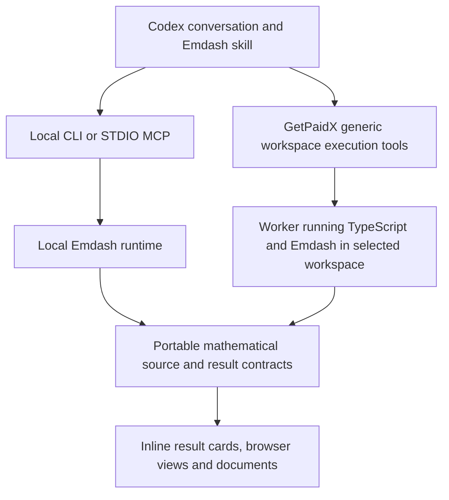

# Emdash Scientific Computing Strategy

Reviewed: 2026-09-28.
Status: user-selected long-term direction; the first local/cloud pilot is
implemented and qualified, with public rollout tracked in the
[release ledger](EMDASH_LOCAL_CLOUD_RELEASE_PLAN.md) and broader capabilities
remaining a roadmap.

Execution clarification: the [workspace execution review](EMDASH_WORKSPACE_EXECUTION_ARCHITECTURE_REVIEW_2026-09-28.md)
refines the initial broker proposal into a small project/run protocol over
TypeScript programs. It evaluates existing mini-app hosting, controller
extensions and native Codex remote facilities. Mathematical functions do not
become individual MCP tools or platform endpoints.

The [local/cloud implementation plan](EMDASH_LOCAL_CLOUD_WORKSPACE_IMPLEMENTATION_PLAN.md)
now supplies the concrete recommended baseline: one generic execution service,
distinct program and immediate Codex-task adapters, a cloud-only Emdash skill
profile and the existing Node mini-app hosting. Its LC-1–LC-4 ledger now records
the completed local implementation, real controller/provider checks, scientific
browser controls and byte-identical captured-source replay. Public hosting and
plugin-directory release remain separate from that qualification.

**Emdash aims to become an open-source, AI-native, cloud-capable scientific
computing system in the TypeScript ecosystem, with integrated functorial type
theory and proof development.** Users should be able to express mathematical
models, compute with them, develop abstract theory about them, explore derived
views and share reusable research work.

The [algebra goal assistant](EMDASH_ALGEBRA_GOAL_ASSISTANT_ORIENTATION.md) is the
first delivered workflow within this broader direction. Scientific computing
includes future numerical, PDE and dynamical-system work; those are directions,
not capabilities established by the current polynomial plugin.

This strategy extends the [CAS architecture](TYPESCRIPT_EMDASH_FOCUSED_CAS_AND_CATEGORICAL_ENGINE_PLAN.md),
[TypeScript/ecosystem review](EMDASH_TYPESCRIPT_HOST_AND_ECOSYSTEM_REVIEW_2026-09-24.md)
and [workspace foundation](TYPESCRIPT_EMDASH_AI_NATIVE_WORKSPACE_AND_PROOF_PLAN.md).
The [handoff](TYPESCRIPT_ELABORATOR_V3_2_HANDOFF.md), active mathematical owners
and their qualification ledgers continue to govern implemented semantics.
The completed [plugin integration](EMDASH_ALGEBRA_GOAL_ASSISTANT_PLUGIN_INTEGRATION_PLAN.md)
is the baseline, not an unfinished cloud implementation.

## Product And Mathematical Direction

Integrated proof development means that a researcher can formulate structures,
assumptions, constructions and theorems about the mathematics being computed.
It does not require proving the implementation of every scientific algorithm
correct. An algorithm can produce useful data; a mathematical interpretation
can expose that data through a typed interface; selected laws can be assumed,
independently checked or proved through the existing formal owners.

The distinctive opportunity is continuity between those activities. A computed
map should remain usable in a complex, an abstract construction and a plot.
The assistant should manage routine source, domain, dependency and artifact
bookkeeping. The mathematical choices remain visible when they matter.

The connection should work in both directions. Abstract typed constructions
can expose computational realizations and lower whole operations to algorithms;
computed objects can enter further abstract constructions through explicit
interpretations. The formal language therefore helps organize and express the
science, beyond attaching certificates to completed calculations.

The aspiration to encompass dependent-type-theoretic mathematics and richer
functorial structure is a research objective. It is not a present claim of
Lean source compatibility, library coverage or completed metatheory. Product
and cloud work can proceed within the current qualified profiles without
reopening the deferred foundational repairs.

The reference systems contribute different lessons. OSCAR demonstrates
integration of specialist algebra systems through a shared programming
environment; CAP/homalg explicitly connects categorical operations and
computable constructions. These are useful precedents for Emdash's mathematical
interfaces, beyond copying their command syntax.
[OSCAR overview](https://oscar-system.github.io/oscar-website/about/),
[CAP architecture](https://homalg-project.github.io/docs/CAP_project-based/).
The opportunity to design a new interface does not establish algorithmic
breadth or performance comparable to those mature systems.

## Four Architectural Responsibilities

| Responsibility | Intended owner |
| --- | --- |
| General programming and authoring | TypeScript functions, modules, packages and application code |
| Scientific computation | Emdash objects, runtime parents/domains, operation contracts, native algorithms and optional engine adapters |
| Formal mathematics | Explicit Core, the qualified checker/evaluator, mathematical libraries and interpretation/proof bridges |
| Research workflow and presentation | Portable workspaces, Codex skills/tools, browser views, documents and cloud hosting |

TypeScript typing, runtime mathematical validation and Core checking are
different services. In particular, a TypeScript interface does not prove its
mathematical laws, and an exact algorithm result is not automatically a Core
proof. Preserve the actual status of assumptions, exact computations,
approximations and checked proofs as work moves between representations.

Formal laws belong with mathematical structures. The ability to run a particular
algorithm belongs with computational capabilities. An abstract object may have
no effective algorithm for an operation; an effective implementation may have
no proof of that operation's correctness. Neither situation should prevent the
other supported uses of the object.

Use TypeScript builders to construct explicit mathematical representations
when inspection, compilation or checking is needed. Ordinary application code
can remain ordinary code. A new whole-program language, a parser and a verified
TypeScript compiler are not prerequisites. Arbitrary TypeScript closures are
not portable mathematical state, and their dependencies cannot generally be
recovered by static inspection.

## Local And Cloud Execution

Recommend shared mathematical libraries and program source, a small project/run
contract and explicit execution targets.
The user's project can live on a local host or in a selected GetPaidX workspace.
The assistant should show the active target and handle routine identifiers.
Moving work between targets should be an explicit source/artifact transfer;
cloud unavailability should not silently run against a different local project.

The diagram describes shared formats and owners, not a shared storage service
or automatic bidirectional synchronization.

**Recommend generic workspace execution behind the existing GetPaidX MCP
endpoint for the first direct desktop-to-cloud implementation.** GetPaidX
supplies identity, workspace selection, permissions, process lifecycle, resource
accounting and artifact access. A selected TypeScript program composes Emdash
library operations inside the workspace. One run can perform many calculations
and constructions without another model turn. GetPaidX does not maintain a
registry of mathematical methods.

Keep the plugins complementary:

- The Emdash plugin owns mathematical workflows and the independently usable
  local runtime.
- The GetPaidX plugin owns authenticated platform operations and the
  generic workspace execution tools.
- Codex can use both sets of tools in one workflow. This is orchestration by
  the host, not a plugin importing another plugin's live session or credentials.

For the pilot, an Emdash skill can use workspace source/run/result tools after
the user chooses a cloud workspace. The current six Emdash tools remain useful
bounded workflow conveniences, rather than a catalog to expand with every
library operation. Adding mathematics should not require new gateway or
controller handlers. Avoid duplicating OAuth connections under both plugins.
Whether a later unified installation should bundle that connection is a
distribution decision to test after the cross-plugin workflow works.

A cloud-only installation also needs a deliberate packaging path. The current
Emdash plugin starts its bundled Node STDIO server; changing a skill's wording
does not remove that host prerequisite. For a pilot, supply the cloud workflow
as a skills-only companion using the existing GetPaidX connection, or include
that workflow in GetPaidX's skill set. Keep its mathematical guidance owned by
Emdash. Test selectable local/cloud installation before promising a single
package with automatic modes. Cloud-only acceptance should work on a host
without a local Emdash runtime or Node requirement from this integration.
If the Codex execution host itself runs in the container, a container-local
Node/STDIO server may instead be appropriate. Native remote-host enrollment
and plugin-path resolution require their own client acceptance.

GetPaidX's existing Node mini-app hosting can supply the scientific browser
workspace, including HTTP/WebSocket proxying. The detailed execution review
recommends reusing that facility while giving compute jobs a separate worker
lifecycle. A headless calculation need not start a browser app.

Alternatives remain useful but solve different problems:

| Route | Assessment |
| --- | --- |
| Existing GetPaidX workspace automation | Near-term way to ask a cloud agent to edit/run TypeScript; adds agent execution and is not a direct mathematical tool API |
| Dedicated Emdash HTTP MCP gateway | Possible self-hosted route for the same project/run contract; adds connection/authentication/lifecycle work for the first GetPaidX consumer |
| Remote STDIO relay | Useful for suitable development hosts; requires an actual supported execution channel |
| Codex remote host or registered executor | Could supply remote conversation access or execution infrastructure; actual GetPaidX/client enrollment is not established by command availability |
| WebMCP in a browser workspace | Browser interaction surface; does not itself connect desktop MCP to a container |

Current OpenAI documentation supports local STDIO and remote Streamable HTTP
MCP, including OAuth. Plugin packaging can supply these connections; it does
not automatically establish cross-plugin dependencies or cloud routing.
[MCP support](https://learn.chatgpt.com/docs/extend/mcp),
[plugin packaging](https://developers.openai.com/plugins/build/plugins).

### The Cloud Boundary Needs Real Work

The existing local adapter accepts an absolute `root` and runs as the local
user. A hosted adapter must resolve an authorized workspace identifier to its
own root and check actor, session, access mode and runtime version on each
operation. A remote client must not choose arbitrary controller paths.

Carry source and retained-result revisions across the boundary. Map local file
results to authorized artifact references and token-free browser links. Keep
the existing mathematical payloads intact while placing platform-specific
addresses and execution receipts around them.

MCP OAuth and the browser's signed-in session are separate contexts. A working
GetPaidX tool connection does not establish browser login, and GetPaidX and
LastRevision have separate origin cookies. Test the artifact handoff as well
as the mathematical call; do not pass controller credentials into the UI.

Use bounded workers and explicit resource profiles. The current plugin's
30-second deadline and 512 MiB V8 heap are local bounds, not a cloud tenant
isolation mechanism or a universal scientific-computing budget. Keep one
authoritative writer for the pilot; its process/PID lock is not a distributed
workspace lock.

Cloud calls need idempotency, cancellation, access revocation, cold-start and
resume behavior. A lost response after a write must be recoverable by inspecting
the operation and its artifacts, rather than blindly repeating the mutation.
Start with bounded workloads and explicit run identity/status/cancellation.
Short runs may return immediately. A distributed scheduler and jobs that
survive workspace shutdown are separate extensions. Record the disconnect
policy explicitly for each kind of run.

Running authored TypeScript is a separate execution capability from accepting
inert mathematical requests. Preserve normal workspace code execution for
general scientific programming. Do not turn inspection or the six current
mathematical tools into arbitrary module execution.

## Research Workspace And User Interface

**Recommend a durable scientific project with several views.** The conversation
directs the work; files retain the mathematical development; the UI presents
selected objects, runs and explanations.

| Surface | Best use | Design constraint |
| --- | --- | --- |
| Codex conversation | Intent, mathematical choices, explanation and continuation | Reference saved objects/results; messages are not the sole durable record |
| Inline MCP Apps card | A result, small plot, parameter control or focused action | Keep it compact and usable through ordinary tool results when UI is unavailable |
| Browser workspace | Large plots, matrices, diagrams, comparison and sustained exploration | Use the same source and operations as the conversation |
| TypeScript plus Markdown | Programmable developments, narrative, reproducible export and review | Preserve ordinary files and explicit execution |
| Notebook presentation | A useful ordered reading or teaching view | Cell layout need not define mathematical identity or hidden execution state |

This gives users conversational interaction without requiring that they abandon
scripts or notebooks. Sage already supports console and Jupyter entry points;
notebook and programming-language choices are separable.
[Sage interfaces](https://doc.sagemath.org/html/en/installation/launching.html).
Emdash can choose source-backed objects and runs as its foundation while adding
an ordered notebook view when a real workflow benefits from one.

Inline UI is a concrete opportunity. GetPaidX's Discover implementation
already registers an MCP Apps HTML resource and associates it with a tool
result. OpenAI's UI guidance describes iframe components, structured results
and the `ui/*` bridge, with portable `_meta.ui.resourceUri` metadata.
Its Codex app-server schema also records resource context for trusted MCP apps.
This supports a pilot, but does not qualify every UI feature in every Codex
app/CLI/IDE installation. Test the actual target client and connection route.
[MCP UI guidance](https://developers.openai.com/plugins/build/chatgpt-ui),
[Codex app-server items](https://learn.chatgpt.com/docs/app-server#items).

An initial Emdash card could show the coefficient domain, exact relation,
freshness and execution location, with actions to inspect the plot, change an
input or reuse the result. Expanded details can explain the selected
interpretation and any assumption. A plot viewport change should stay local UI
state; a mathematical parameter change should create a source revision and
invalidate dependent output. Old cards should identify the result they show,
and edits from them must reject stale revisions.

WebMCP serves a different role: a web page registers operations through
`document.modelContext` for browser agents. GetPaidX already projects its MCP
inventory into that mechanism. Reuse discovery and handlers if the scientific
browser view needs it; feature-detect the browser API and preserve normal UI
controls. Do not make WebMCP availability a prerequisite for direct cloud tools.
[WebMCP API](https://developer.chrome.com/docs/ai/webmcp/imperative-api).

### What Persists

A useful research workspace should retain:

- mathematical source, input data and domain/interpretation choices;
- explicit object and operation dependencies where the supported program
  representation provides them;
- run records identifying source, inputs, engine/runtime versions and relevant
  parameters, with reusable output artifacts;
- mathematical evidence and assumptions where requested;
- narrative notes and views derived from those sources.

Start from the current ordinary files and revision checks. Add a small manifest
only when multiple sources, runs or artifacts need coordination. Do not freeze a
universal notebook schema or infer a dependency graph from arbitrary TypeScript.
The existing research-goal graph and algebra computation graph have different
semantics; neither should be relabeled to absorb all of this state.

Choose one authoritative authoring path per input. The current plugin edits
inert JSON directly. A future TypeScript-authored project may generate that
JSON explicitly; its UI then updates the owning TypeScript/parameter source,
not an independently editable competing copy. Persisted output and a run
receipt establish reproducibility context, not proof of an algorithm's
execution or correctness.

Beyond exact algebra, numerical work will require precision/tolerance,
discretization, units where relevant, seeds, environment and data provenance,
and scientifically meaningful validation. A residual or convergence experiment
is not interchangeable with a proof. These deserve a concrete numerical
consumer before a general framework.

## Standalone Runtime Direction

The long-term native path should work without Singular, Lambdapi or a cloud
account. The current native CAS and graduated TypeScript Core profiles already
provide parts of this route. External engines can remain useful optional
accelerators, comparison oracles and interoperability adapters.

There are two independent migration ledgers: algorithm coverage/performance
and checker/evaluator coverage. Replacing a Singular operation requires
appropriate native algorithm evidence. Retiring Lambdapi's remaining required
conformance role requires the recorded checker/profile graduation evidence.
A plugin transport or successful cloud run achieves neither.

Keep mathematical meaning independent of an engine's process handles or
representation. TypeScript is the primary host and native implementation path;
optional WASM/native acceleration can fit behind the same operation contracts
when measured workloads justify it. Owning a standalone CAS does not require
foregoing interoperability or claiming that JavaScript has already matched
specialist numerical runtimes.

## Open Research And Commercial Services

The user-selected model combines an open-source academic Emdash project with
commercial services, especially GetPaidX/LastRevision workspaces and community.
The core mathematics, portable formats and local workflow should remain useful
independently of the hosted service. This supports academic adoption, grant
applications, reproducibility and contributions.

Potential paid offerings include managed compute/storage, team workspaces,
institutional support, integration and training, reproducible publication
services, and expert-maintained scientific workflows. GetPaidX/LastRevision
can connect a reusable calculation or research workspace to a publication,
course, consulting engagement, seminar or marketplace offering. These are
revenue hypotheses to validate, not established demand or pricing.

The durable commercial advantage would come from reliable execution,
collaboration, distribution, expert content and service relationships.
Plugin connectivity helps distribution; it is not by itself a defensible
advantage. Future OpenAI collaboration or endorsement is an opportunity rather
than a dependency of the product architecture or business case.

Begin with a narrow audience already close to the implementation: researchers,
educators and consultants sharing computational algebra and mathematical
exposition. Measure completed/reused workflows, time to a useful result,
repeat usage, support effort and compute/storage cost. Breadth into other
scientific domains should follow demonstrated users and maintainable methods.
No license or publication terms change through this strategy document.

## Proposed Next Slice

Recommend an **Emdash cloud workspace pilot**, with the existing bounded
polynomial workflow as its acceptance case:

1. Package the required supported Emdash APIs/runtime as explicit versioned
   workspace dependencies; select the cloud-only desktop installation route.
2. Add generic source/run/result access through the existing GetPaidX
   connection, with a controller-managed worker and existing workspace policy.
   Use the mini-app proxy for the optional browser workspace.
3. Demonstrate a desktop Codex session executing one TypeScript program that
   composes several Emdash operations, inspecting its plot, changing the input,
   reusing retained coefficients and resuming from saved results after closure.
4. Add one inline result card if the target host supports it; retain a browser
   artifact link and ordinary structured/text output.
5. Export the project and rerun it locally at the pinned runtime version.

Adding a further library operation to the program should leave the platform's
tool inventory and routes unchanged. The [execution review](EMDASH_WORKSPACE_EXECUTION_ARCHITECTURE_REVIEW_2026-09-28.md)
owns this refinement of the initial six-command broker proposal.

The mathematical example should retain the actual relation
`g = a1*f1 + ... + an*fn`, construct the native complex from those coefficients
and keep the optional internal route's computed-equation assumption explicit.
Compare exact source/results across transports; this need not establish
byte-identical platform receipts or floating-point plots.

Acceptance should include wrong-workspace denial, stale-source rejection,
runtime mismatch, cancellation, interrupted-write recovery, bounded resource
use, stop/reopen behavior and artifact access. Record the actual app/CLI and
browser capabilities exercised, not only mocked widget or transport tests.

Keep broad PDE support, a general job scheduler, multiwriter collaboration and
a full notebook editor as later consumers. A useful subsequent scientific
expansion could be a small ODE/parameter-sweep workflow: connect an explicit
model, numerical method, convergence diagnostics and plots, then identify the
formal interfaces worth developing. That is a proposed consumer, not current
numerical support.

The [implementation plan](EMDASH_LOCAL_CLOUD_WORKSPACE_IMPLEMENTATION_PLAN.md)
now selects a skills-only cloud companion, generic execution records and
separate program/agent starts, a pinned workspace runtime artifact and browser
preview before inline UI. It records source/run storage responsibilities and
cross-repository validation. Runtime implementation and public deployment have
not started.

## Review Evidence

Read-only review used Emdash `13523b87`, Arrowgram `214ec0a` and GetPaidX
`a03c667a`. No fresh mathematical qualification was performed.

- Emdash's [command catalog](../src/v3_2/algebra_goal_commands.ts),
  [local MCP adapter](../src/v3_2/algebra_goal_mcp.ts) and
  [runtime guide](../plugins/emdash/README.md) establish the current six tools,
  inert source, local root contract, bounded workers and absent cloud transport.
- In the optional sibling checkout `~/arrowgram`, inspected
  `plugins/getpaidx/README.md`, its MCP/manifest files and plugin guidance.
- In the private sibling checkout `~/closerfans`, inspected
  `scripts/mcp/getpaidx-mcp-server.ts`,
  `scripts/mcp/getpaidx-discover-widget.ts`,
  `src/lib/programmatic-api/catalog.ts` and
  `src/lib/webmcp/mcp-tool-projection.ts`. These supply the platform/UI
  precedents; private implementation is not copied into this repository.
- The sibling `templates/emdash_ts/README.md` and
  `templates_artifacts/emdash_goal_graph/README.md` describe existing proof
  and goal-view starters. They do not establish cloud deployment of the newer
  algebra plugin runtime.
- Read-only hosted catalog inspection at 2026-09-28 11:41 UTC returned catalog
  version `2026-09-14`: search for `emdash` returned no endpoints/workflows;
  `run_workspace_automation` remains an idempotent queued Codex task under
  `workspaces:run`. This establishes the inspected catalog surface, not the
  absence of every possible internal integration. No cloud job was submitted.
- The existing source-file API is Arrowgram-allowlisted. It must not be assumed
  to read/write arbitrary Emdash files merely because both products use
  workspaces.

The linked official platform documentation was fetched during this review.
No live inline-UI acceptance, cloud computation or public release is claimed.
Documentation changes receive the repository's document hygiene checks.
