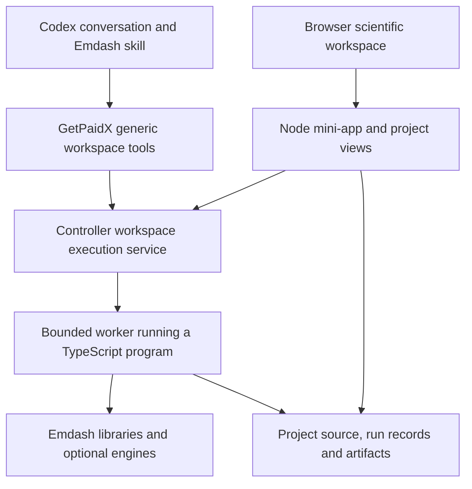

# Emdash Workspace Execution Architecture Review

Date: 2026-09-28
Status: architecture recommendation for review; implementation not started
Baseline: `8c2d7edb`, the checkpoint of the initial scientific-computing strategy

The user broadly agrees with the [scientific-computing strategy](EMDASH_SCIENTIFIC_COMPUTING_STRATEGY.md)
and asks to clarify execution granularity, existing GetPaidX mini-app hosting,
Codex remote control and possible controller extensions before implementation.
The suggested mechanisms are alternatives to assess, not required technologies.
Local review/documentation checkpoints are explicitly authorized.

Forward implementation baseline: the
[local/cloud implementation plan](EMDASH_LOCAL_CLOUD_WORKSPACE_IMPLEMENTATION_PLAN.md)
resolves the choices below into a concrete recommendation for the next turn.
It gives program and immediate Codex-task execution separate adapters over a
shared lifecycle, while preserving their distinct purposes. This review
retains the alternatives, source evidence and separate GetPaidX reassessment.

## Recommendation And Correction

**Keep the mathematical API in TypeScript. Expose a small workspace execution
protocol to the agent. Run programs near their data, with a browser application
as an optional view of the same project.**

The initial strategy's proposal to project Emdash's current command catalog into
GetPaidX was too narrow as a long-term architecture. The six existing commands
are useful workflow conveniences for one bounded polynomial profile. They
must not grow into a remote tool inventory mirroring every mathematical
function, constructor or theorem.

The scalable unit of remote execution is a program or declared task. One
TypeScript program can build a ring, perform many algebra operations, construct
an object, check selected formal terms and produce several views. Those calls
stay inside the workspace process. Adding a library operation should require
no corresponding gateway endpoint, controller handler or MCP tool.

Distinguish three levels:

| Level | Growth model |
| --- | --- |
| Emdash library API | Expands with the mathematics and algorithms |
| Workspace execution protocol | A small set of source/run/result/lifecycle operations |
| Network transport | Carries those operations over MCP/HTTP or a supported executor connection |

An MCP HTTP URL, an MCP tool and a mathematical library function are different
things. Moving thousands of mathematical methods behind one
`call(operation, args)` tool would still leave the wrong library-to-RPC
coupling. The proposed run protocol transports a program reference and inputs;
it does not interpret a second enumeration of all mathematical operations.

## Component Responsibilities



This is the recommended hosted arrangement, not the current deployed route.
Local execution runs the same program with a local runner. GetPaidX credentials
and infrastructure do not enter the mathematical libraries.

| Component | Owns |
| --- | --- |
| Emdash libraries | Mathematical objects, algorithms, formal interfaces, serializers and views |
| Scientific project | TypeScript source, declared inputs, runtime/dependency pins and reusable results |
| Node worker | Execution of a chosen program against its captured inputs |
| Workspace execution service | Job identity, launch, output, cancellation, limits and lifecycle |
| GetPaidX gateway/controller | Identity, workspace authorization, process user, routing, billing and persistence integration |
| Optional Node mini-app | Human-facing project views and controls over the same source/runs |
| Codex skill | Mathematical guidance, API discovery, source authoring and interpretation of results |

Choose one owner for execution state. In the hosted pilot the controller's
workspace execution service owns job lifecycle; the Emdash mini-app consumes
it. Do not create an independent competing queue in the Emdash server.
Mathematical results and evidence retain their own Emdash owners.

The mini-app is useful for sustained interaction but is not required to run a
headless TypeScript calculation. Expensive computation belongs in workers so
that the HTTP server and visual interface remain responsive.

## Small Agent-Facing Contract

The following are responsibilities, not frozen public names or implemented
endpoints:

| Responsibility | Request/result |
| --- | --- |
| Describe workspace | Runtime versions, permitted execution profiles, project/source metadata and API documentation references |
| Read/change source | Scoped files or patches, with expected source revision |
| Start program | Workspace, source revision, entrypoint/task, parameters and resource profile; returns a run identity |
| Inspect/wait | Run state, bounded logs/progress and result/artifact references |
| Cancel | Request cancellation of the identified run and report the actual terminal state |
| Inspect results/open view | Structured summaries, artifact content or an authorized browser handoff |

Retain distinct read/edit/execute permissions and tool annotations. A small
number of clear tools is preferable to hiding arbitrary effects behind one
untyped universal dispatcher. The count need not be fixed now; it should stay
independent of the number of mathematical operations.

Illustrative program request, not an existing API:

```json
{
  "workspaceId": "selected-workspace",
  "expectedSourceRevision": "source-revision-from-inspection",
  "entrypoint": "experiments/relation-family.ts",
  "parameters": { "sampleCount": 20 },
  "resourceProfile": "bounded-node",
  "idempotencyKey": "one-logical-run"
}
```

The ordinary TypeScript module imports the pinned Emdash API and composes its
operations directly. The agent learns that API from declarations, examples and
documentation in the workspace. It need not discover one MCP tool per function.
Existing retained computation representations remain useful where their
mathematical compiler needs them; no new universal mathematical DSL is required.

Start with explicitly executed files or declared tasks and fresh workers.
Short calculations can still return immediately through the same run record.
Later warm-worker caches or interactive sessions may improve latency, but their
object handles must not become the only saved form of the development.

Large matrices, samples and intermediate results should stay near the worker.
Return compact summaries and artifact references, fetching details when useful.
Batch related operations in the program to avoid a network round trip per
matrix entry, constructor or algorithm step.

### Source And Execution Boundary

The run service records the actual source/input snapshot, runtime and package
versions, parameters and artifacts. An expected source revision alone is not a
snapshot: imports must not change underneath a running job. Use a captured
source/dependency closure or an appropriately isolated project snapshot, and
check the relevant revision before promoting results into the current view.

Reproducibility records do not make arbitrary TypeScript deterministic or
certify its result. Record external data, randomness and numerical settings
when relevant. Exact computation, approximation, assumption and checked proof
keep their existing mathematical meanings.

This is an explicit new program-execution capability. The existing six Emdash
tools continue to accept inert data and execute fixed bundled workers.
Inspection does not acquire permission to load user modules. General execution
must be available under the selected workspace execution profile, with the
same distinctions for local and cloud hosts.

The current package/plugin exports do not expose every contributor API.
The first program must use supported, pinned distributable APIs or qualify the
specific additional packaging it requires. A cloud image must not depend on
an unrecorded import into the developer's checkout.

## What GetPaidX Mini-App Hosting Already Supplies

The inspected controller:

- accepts configurable install/start commands and a project-relative working
  directory;
- chooses an available local port and supplies it to the app environment;
- detects readiness and proxies authenticated HTTP and WebSocket traffic;
- tracks the managed live app by post and shares it across relevant sessions;
- provides persistent project/data locations and tracks process descendants.

Thus an Emdash browser application can be a normal Node mini-app in a workspace.
There is no need for one externally published port or one gateway route per
mathematical feature.

The current implementation manages one live-app target per post, rather than
an arbitrary collection of publicly addressable container ports. Several
internal services could sit behind that app, or a future controller service
registry could route logical service identifiers to approved local targets.
Reuse the existing proxy first; add multi-service routing only for an actual
consumer.

Browser preview authentication does not automatically authorize OAuth MCP
calls into that app. The new gateway adapter must resolve the caller's
workspace rights and route through the controller using platform-owned
credentials. The model supplies a logical workspace/service identity, not a
controller token, arbitrary URL or arbitrary port.

The existing app process is shared by post. Do not infer the current editor or
viewer from that process's environment. A general program run belongs to the
authorized execution identity and its workspace permissions. Running arbitrary
authored code must not execute in the privileged controller manager process.
Viewer access to a published scientific app need not grant source editing or
general program execution; a later product can expose selected parameterized
tasks under its own permission profile.

### Appropriate Controller Extensions

The user explicitly permits considering controller/manager changes. Recommend
generic workspace capabilities: bounded program launch, run inspection/events,
cancellation, scoped source access and artifact retrieval. The exact internal
routes remain to be designed.

The controller should understand a workspace, process, source snapshot and
run. It should not need to understand rings, Gröbner bases, chain complexes or
PDE operators. Emdash versions and programs can then evolve independently of
GetPaidX controller releases.

Reuse the current lifecycle and permission mechanisms where appropriate.
Separate the long-lived app lifecycle from short-lived compute jobs, and from
optional durable jobs that survive a disconnected client. Idempotency handles
lost replies; cancellation must reach worker descendants; controller restart
must report interrupted work accurately. This needs a small job facility, not
a general workflow engine.

The present public source-file route is Arrowgram-allowlisted, and
`/jobs/codex/exec` in the controller accepts a Codex prompt. Neither already
implements the proposed generic TypeScript run protocol. Extend them only
through a reviewed new capability; do not treat a hidden admin route or an
interactive terminal connection as an existing public execution API.

## Codex Remote Facilities

The installed CLI is `0.158.0`. Its help exposes `remote-control`,
`app-server`, `--remote`, `exec-server` and `exec-server forward`.
Only version/help commands were run; no daemon, listener, pairing, registration
or model session was started.

### Remote Control And Remote Conversations

`codex remote-control` manages an app-server daemon with remote control
enabled; `pair` supplies a short-lived pairing code. This can be relevant when
the desktop acts as the UI for a Codex host associated with the cloud
workspace. It is not an Emdash protocol.
[Official command documentation](https://learn.chatgpt.com/docs/developer-commands#codex-remote-control).

This need not introduce a second agent. A user can interact with one
conversation hosted remotely. That is different from a desktop conversation
delegating a natural-language task to another cloud conversation.
It is also different from keeping the current desktop conversation and
attaching a remote execution tool.

The documentation establishes a remote CLI connection to app-server.
It does not establish that an arbitrary GetPaidX container can be paired into
this existing desktop thread with the intended account, plugin, workspace and
billing behavior. That exact client flow needs a targeted acceptance test.
[Remote CLI connection](https://learn.chatgpt.com/docs/app-server#connect-the-cli-terminal-ui).

### App-Server As An Execution Adapter

App-server also documents `command/exec`, which runs a command without
creating a thread. This could implement part of a workspace execution adapter
without another model turn. The separate `process/*` and
`thread/shellCommand` facilities have different sandbox behavior; they are
not interchangeable authorization paths.
[Command execution](https://learn.chatgpt.com/docs/app-server#command-execution).

Treat this as a candidate private adapter. The documented app-server/WebSocket
surface is experimental; publishing the whole server to a workspace viewer
would expose much more than scientific program execution. A small platform
contract should survive a change of execution backend.

### Exec-Server And Registered Execution Environments

`codex exec-server` is more directly related to remote filesystem/process/MCP
execution. The official self-hosted-sandbox guide describes an executor in the
user's environment, connected outbound to an Agents API session with its own
environment registration and restricted credentials.
[Self-hosted execution](https://developers.openai.com/api/docs/guides/agents-api/environments/self-hosted).

This is promising infrastructure to evaluate, but that documented API flow is
not evidence of transparent enrollment into an existing consumer Codex desktop
thread. Adopting it as an Agents API product would also introduce a distinct
session/account/billing integration. Do not silently change the product from a
Codex plugin to a new agent service to obtain a transport.

Codex also documents remote STDIO MCP when a remote execution environment is
already available. This may allow the Emdash process to remain local to the
container. It still requires an accessible remote runtime/plugin installation;
a desktop cache path is not automatically a container path.
[Remote STDIO option](https://learn.chatgpt.com/docs/extend/mcp#stdio-servers).

## Recommended Route And Alternatives

| Route | Recommendation |
| --- | --- |
| Current conversation uses generic GetPaidX workspace run tools | Preferred first product route: existing OAuth/platform integration, composed TypeScript programs and explicit project/run state |
| Desktop/CLI attaches to a cloud Codex host | Useful optional experience if actual pairing/account/client acceptance succeeds; can reuse container-local Emdash tools |
| Native registered executor or app-server behind an adapter | Evaluate for implementation reuse; do not make undocumented desktop enrollment a prerequisite |
| Existing GetPaidX Codex automation | Retain for intentional agent delegation; not required for ordinary program execution |
| Emdash-specific remote math-method catalog | Reject as the long-term extension mechanism |

Prefer a small controller-managed Node worker adapter for the first run
contract, reusing GetPaidX's existing process facilities. A native Codex
executor could replace that adapter if it meets the same requirements with
less maintenance. Both must preserve workspace authorization, source capture,
resource limits, artifact access and recovery.

The browser mini-app path is valuable whichever execution adapter wins.
MCP Apps cards, WebMCP page tools and the ordinary browser UI should consume
the same run results and project state, without introducing another
mathematical implementation.

## Proposed Decisions Before Implementation

Recommend accepting these architecture boundaries:

1. TypeScript/library programs are the extensible computational interface.
2. Agent tools manage projects, executions and results at coarse granularity.
3. GetPaidX owns generic hosting/execution policy, with no mathematical method
   registry in its gateway or controller.
4. Emdash's browser workspace is an ordinary optional Node mini-app.
5. Current-conversation remote execution and remotely hosted Codex conversations
   are distinct supported-design possibilities; agent delegation is optional.
6. The first implementation targets one editor workspace, fresh bounded
   workers and the existing algebra consumer. It does not build a notebook
   kernel, distributed scheduler or multiwriter synchronization system.

Implementation planning must still freeze the concrete run/file/result schema,
runtime artifact, storage/snapshot location, identity propagation and tested
desktop/browser client. A focused native-Codex feasibility check can answer the
remaining enrollment question; it does not require revising the mathematical
or workspace model.

A decisive acceptance example is one TypeScript program performing several
Emdash operations in one run, invoked from the current desktop conversation,
viewed through the existing app proxy and replayed locally. Add one additional
library-level operation without changing the platform's tool inventory or
routes. This directly tests the maintenance concern raised by the user.

## Evidence And Checkpoint Scope

### Separate GetPaidX MCP Reassessment

During this review the user separately asked whether the existing GetPaidX MCP
should expose immediate `codex exec` tasks rather than require queued
automation. This concerns GetPaidX's earlier design; it does not select a
different Emdash architecture or authorize implementation now.

**Assessment: yes, review adding an immediate workspace-agent task capability.
Its controller execution mechanism already exists; the public API/MCP
integration and its lifecycle/permission contract are the missing part.**
The user confirms that this immediate-versus-queued MCP distinction is the
intended concern, with scheduled automations retaining their existing role.

The inspected paths are:

| Surface | Current behavior |
| --- | --- |
| Public `POST /api/workspace/automations/runs` | Checks `workspaces:run` and post authorship, creates a `QUEUED` database row and returns a run ID |
| `scripts/workspace-automations-process.ts` | Claims a queued row, starts an automation workspace session as the post author and calls the controller |
| Controller `POST /jobs/codex/exec` | Requires controller authentication, resolves a workspace session, checks read-write edit access and immediately calls `runCodexJob`; can stream progress |
| Browser `POST /__gp/codex-easy/message` | Uses the active session, checks read-write edit access and immediately calls the same helper, without the automation queue |
| `runCodexJob` in `controller/src/server.ts` | Starts `codex exec` or `codex exec resume`, sends the instruction string on stdin and returns execution/session results |

The queued path is therefore:

```text
MCP -> public automation API -> queued row -> automation processor
    -> controller /jobs/codex/exec -> runCodexJob -> codex exec
```

The direct browser path already skips that queue and processor:

```text
Codex Easy browser request -> authenticated controller session
    -> runCodexJob -> codex exec
```

A worker script claims the queue; this does not require a resident language
model to watch for work. The processor supports different deployment contexts,
including a gateway/container worker and ACA Jobs. An ACA Job is not inherent
to `codex exec`. No deployed scheduler configuration was audited here.

Read-only live catalog search for `codex` at 2026-09-28 14:55 UTC, catalog
version `2026-09-14`, returned configuration-write, session-list, log and usage
endpoints, plus the queued `run_workspace_automation` workflow. It did not
return an immediate prompt-execution endpoint. The inspected gateway routes
and MCP source likewise do not establish that public capability. Existing
browser/controller code is source evidence, not a fresh production execution
test.

Terminology matters:

- `codex exec` consumes instructions and runs an AI agent. Making its launch
  immediate removes scheduling latency, not the model turn.
- App-server `command/exec` consumes an argument vector and executes a
  process without creating an agent conversation.
- A TypeScript program run is ordinary execution of a selected program.
  Its scheduling policy is a separate choice.

[Non-interactive Codex](https://learn.chatgpt.com/docs/developer-commands#codex-exec)
and [app-server command execution](https://learn.chatgpt.com/docs/app-server#command-execution)
document those different interfaces. Native `remote-control` is not needed
merely to expose the existing immediate prompt runner.

The current helper uses the workspace session's editor identity, project
directory, `CODEX_HOME` and configured provider context. Its arguments include
`--yolo`, and the generated default profile uses approval policy `never`
and sandbox mode `danger-full-access`. The user explicitly confirms this is
intentional for the managed workspace. Preserve that execution mode; this
review does not propose importing desktop approval prompts or treating
`--yolo` as a blocker.

Here, inheriting permissions means retaining the authenticated GetPaidX
principal, authorized workspace session, execution identity, filesystem access
and billing context. Desktop conversation approval-state inheritance is not a
requirement. A new public route must enforce the existing platform authorization
boundary while retaining the intended unattended workspace execution.

Recommend a public, actor-bound immediate-task route/tool that reuses this
controller runner through the gateway. It should bind the caller to their
permitted active session, preserve billing/access rules, validate ownership
of any resume reference, keep controller credentials server-side and record
an idempotent invocation before dispatch. The existing helper exposes
resume/progress options but no explicit per-run deadline/cancellation
parameter; review those controls, concurrency and disconnect recovery before
public exposure.

Immediate dispatch does not require keeping an MCP request open until the
agent finishes. It can return a run handle promptly and support progress,
result and cancellation calls while execution stays in the active controller.
A durable receipt is useful even when no scheduling service participates.

Keep scheduled/event-triggered automation for its existing purpose. Separate
the choice of execution kind (agent instructions or program) from the choice
of dispatch (immediate or queued). This is a targeted GetPaidX API/MCP
improvement, independent of Emdash's proposed direct program execution.

### Review And Local Checkpoints

GetPaidX source review used unchanged relevant paths at `a03c667a`:
`controller/src/server.ts`, `controller/src/user-app-readiness.ts`,
`controller/src/process-lifecycle.ts`, `controller/src/runtime-timeout.ts`,
`src/lib/workspace/runtime-config.ts`,
`src/lib/workspace/controller-session.ts` and
`docs/workspace-guest-apps.md`. These are optional sibling-checkout references;
no private implementation is copied into Emdash.
The adjacent MCP reassessment additionally inspected
`src/app/api/workspace/automations/runs/route.ts`,
`src/app/api/workspace/codex/files/write/route.ts`,
`scripts/workspace-automations-process.ts` and the Codex Easy smoke source;
those tests were read, not rerun.

Emdash's [plugin configuration](../plugins/emdash/.mcp.json),
[launcher](../plugins/emdash/scripts/start-mcp.mjs) and
[command catalog](../src/v3_2/algebra_goal_commands.ts) establish its actual local
Node/STDIO behavior and current bounded workflow tools. Node can run in either
host; transport and installation location determine which host executes it.

The initial strategy is checkpointed at `8c2d7edb`. This follow-up changes
documentation only and preserves that checkpoint. It does not modify sibling
repositories, launch services, qualify cloud execution, change mathematical
profiles, publish or push. Validation is exact diff and document hygiene;
implementation checks belong to the subsequently selected tranche.
